12、[Error Code](#12) 
13、[FAQ](#13) 

## <h2 id='12'>12 Error Code</h2>
以下是错误码摘要：

|Constants|Value|Note|
|---|---|---|
| ATSDKInitErrorDomain |@"AnyThinkSDKInitErrorDomain.com.anythink"|(初始化失败)SDK Initialization Error Domain|
| ATSDKInitErrorCodeDataConsentNotSet | 2001 |(没有设置GDPR)GDPR consent not set|
| ATSDKInitErrorCodeDataConsentForbidden | 2002 |(由于GDPR被设置成Forbidden所以初始化失败)Initializtion failed due to GDPR being set to forbidden|
| ATADLoadingErrorDomain |@"ATNativeADLoadingErrorDomain.com.anythink"|(广告加载失败)Ad loading error domain|
| ATADLoadingErrorCodePlacementStrategyInvalidResponse | 1001 |（无效策略）Placement strategy invalid|
| ATADLoadingErrorCdoePlacementStragetyNetworkError| 1002 |(策略加载失败)Placement strategy loading error|
| ATADLoadingErrorCodeADOfferLoadingFailed | 1003 |(第三方平台加载失败)Third party SDK ad loading error|
| ATADLoadingErrorCodePlacementStrategyNotFound | 1004 |(没有策略)Placement Strategy not found|
| ATADLoadingErrorCodeADOfferNotFound | 1005 |(没有广告展示)No ad found when trying to show ad|
| ATADLoadingErrorCodeShowIntervalWithinPlacementPacing | 1006 |(请求或展示过于频繁)Ad show/request too frequent|
| ATADLoadingErrorCodeShowTimesExceedsHourCap | 1007 |(展示或请求超过小时内最多展示次数)Ad show/request too many time within the same hour|
| ATADLoadingErrorCodeShowTimesExceedsDayCap | 1008 |(展示或请求超过一天内最多展示次数)Ad show/request too many time within the same day|
| ATADLoadingErrorCodeAdapterClassNotFound | 1009 |(没有导入对应的Adapter)Adapter not imported|
| ATADLoadingErrorCodeADOfferLoadingTimeout | 10010 |(广告加载超时)Ad loading timeout|
| ATADLoadingErrorCodeSDKNotInitalizedProperly | 1011 |(SDK没有初始化)SDK not initialized properly|
| ATADLoadingErrorCodeDataConsentForbidden | 1012 |(由于GDPR被设置成Forbidden所以加载失败)Ad loading failed due to GDPR being set to forbidden|
| ATADLoadingErrorCodeThirdPartySDKNotImportedProperly | 1013 |(没有导入第三方平台的SDK或导入了错误的版本)Third party SDK not imported or wrong version's being used|
| ATADLoadingErrorCodeInvalidInputEncountered| 1014 |(无效的App ID、App Key 或Placement ID)Invalid parameters encountered(App ID、App Key orPlacement ID being nil)|
| ATADLoadingErrorCodePlacementAdDeliverySwitchOff | 1015 |(广告位没有开启广告投放)Ad delivery not turned on for the placement|

## <h2 id='13'>13 FAQ</h2>
### 13.1 应用程序没有编译(App Not Compiles)
如果您的项目没有编译，并且Xcode发出这样的一些错误信息： **"Undefined symbols for architecture..."** 或是 **"ld: symbol(s) not found for architecture..."**:
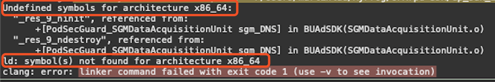

您的项目中缺少了一些modules，请使用Xcode中列出的错误信息找到缺失的modules，并将其添加到您的项目中就可以解决问题:
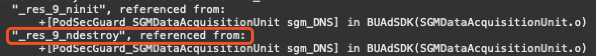

在Xcode列出的日志中，您可能会发现这样的消息**"some_symbols", referenced from:**, 用 **"some_symbols"** 去找到您缺失的 modules。这里举一个例1:

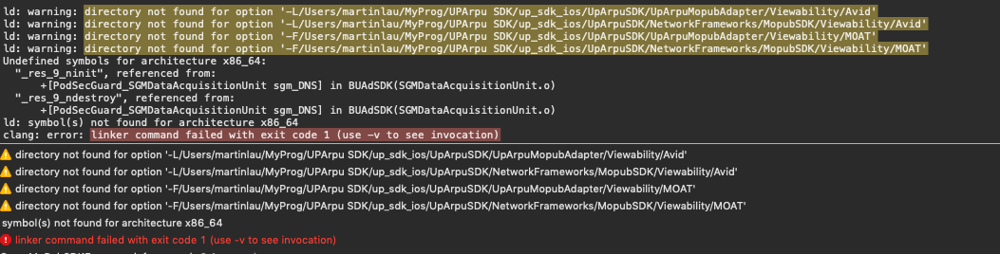
这里的未定义符号 **\_res\_9\_ninit** 和 **\_res\_9\_ndestroy**, 使用 **Google** 或者 **Baidu** 搜索，您会发现这两个符号是在 **libresolv.9.tbd** 中定义的。所以解决这个问题，只需要将**libresolv.9.tbd**添加到您的项目中： 
1) 导航到 **Build Phases**, 点击 **Link Binary With Libraries**: 
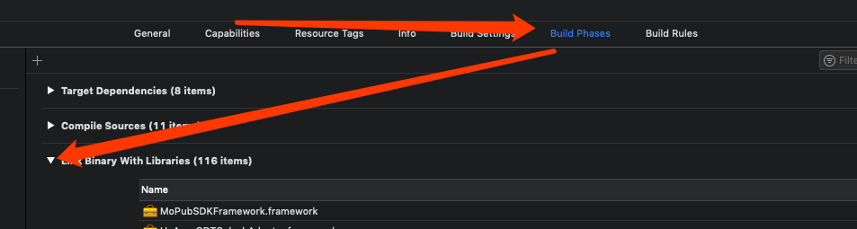

2) 点击 **+** 按钮, 搜索resolv, 点击 **libresolv.9.tbd**, 然后点击**Add**按钮添加 **libresolv.9.tbd** lib 到您的项目中:

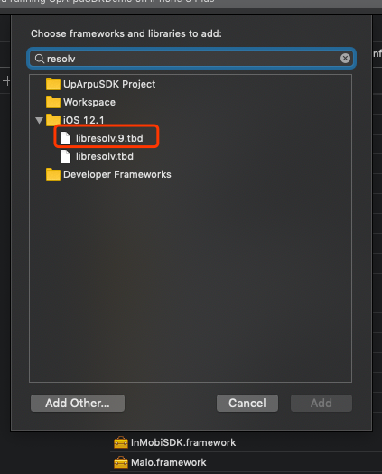

例2.
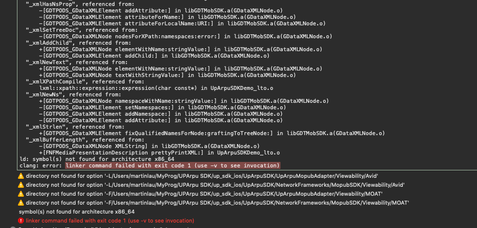
搜索之后发现缺失的symbol是在 **libxml2.tbd**中被定义的(例如**\_xmlStrlen** 和 **\_xmlBufferLength**)使用上述的方法把它添加到您的项目即可解决。

### 13.2 启动时崩溃(App Crashes on Launching)
应用程序在启动时崩溃时因为您缺少了某些配置，我们这里给出几个例子：

1) 在**Build Settings**中的**Other Linker Flags**缺失**-ObjC** flag配置项：

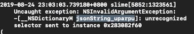

如果你遇到了这种错误，您可以在Xcode导航到**Build Settings**中，找到**Other Linker Flags** 双击它，点击**+**并添加**-ObjC**即可：
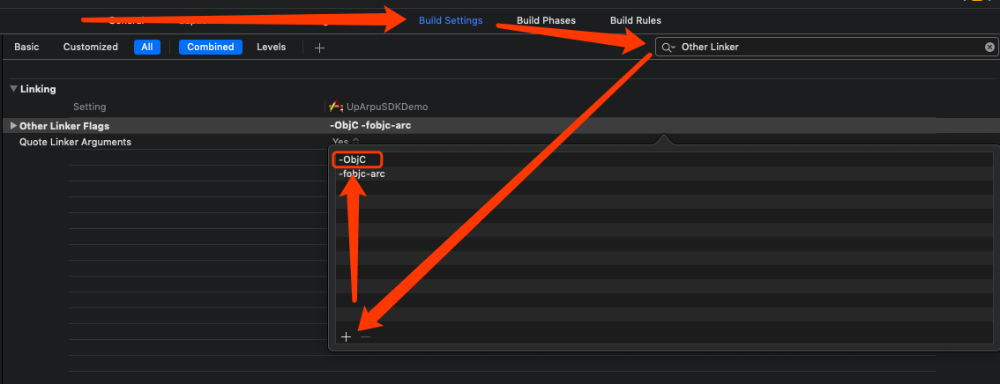
**注**: **Linker Flags** 是需要**区分大小写的**。 

崩溃还有可能是:
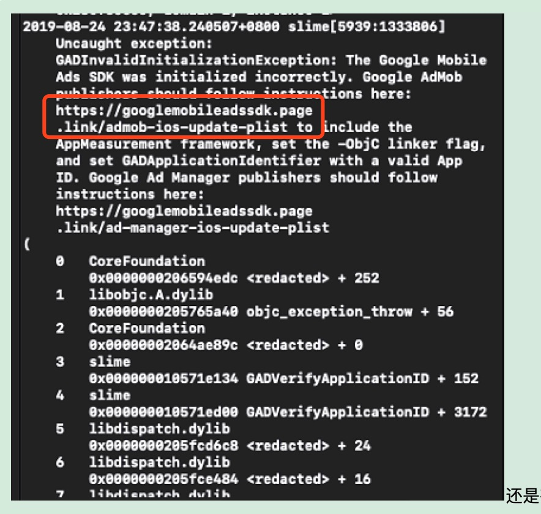

您遇到这个崩溃时因为您添加了Admob的SDK，但是没有在Info.plist中配置AppID：
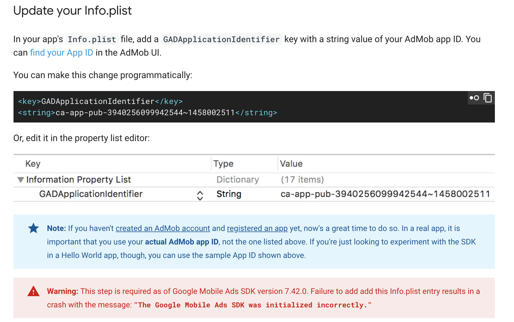
**注: 如果您的应用程序导入了Admob的SDK，请保证您的app配置了以上操作。**

### 13.3 App加载广告失败(App Fails to Load Ad)
可能会有各种因素导致您的应用程序加载广告失败，这里举几个例子：

如果您app加载广告失败，并在控制台日志中找到类似于这样的信息**This might be du to ... SDK not being imported or it's imported but a unsupported version is being used.**，这是因为您没有将第三方平台的SDK导入到您的项目中。
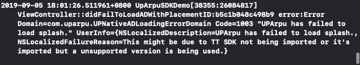 
您的app缺失了Toutiao的SDK（**BUAdSDK.framework** 和 **BUAdSDK.bundle**）将这两个资源文件添加到您的项目中。

如果有类似于这样的错误信息**Adapter initialization failed**，这是由于您的项目中没有添加特定的Adapter。您需要将您所需要的对应平台的对应广告形式添加到您的工程中即可。

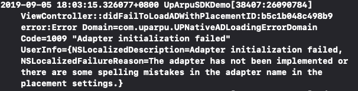
