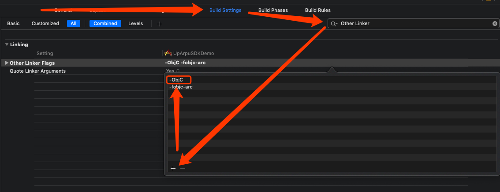

# **iOS集成AnyThinkSDK**

1、[简介](#2) 
2、[配置](#1) 
3、[开屏广告(Splash)](#3) 
4、[激励视频(Rewarded Video)](#4) 
5、[插屏广告(Interstitial)](#5) 
6、[Banner广告](#6) 
7、[原生广告(Native)](#7) 
8、[(原生Banner)Native Banner](#8) 
9、[(原生Splash)Native Splash](#9) 
10、[头部竞价(Header Bidding)](#10) 
11、[通用数据保护条例GDPR](#11) 

## <h2 id='2'>1 简介</h2>
本文档介绍如何去集成iOS端的AnyThinkSDK（后面简称为SDK），包括获取开发者账号，获取AppID和AppKey并创建配置进行广告投放。
### 1.1 支持的广告类型
AnyThinkSDK支持原生广告(Native),激励视频广告(rewardVideo)，banner广告，插屏广告(intersitial)和开屏广告(splash)。
### 1.2 SDK架构

如上图所示，整个SDK可以被分为三层(额外的第三方SDK不属于AnyThinkSDK层级)。根据下方的指引引入具体模型。

|层级|指引|
|----|----|
|AnyThink's Core Module|必须要引入如上图所示的Core Module层的两个framewrok到你的项目中|
|AnyThink's Format Module|只引入你需要用到的广告形式对应的framework到你的项目中，如果项目中不需要用到的广告形式，则不用引入，可以看下方例子|
|AnyThink's Adapters|只引入你需要集成的第三方平台对应的广告形式的adapter.framewrok，可以看下方例子|
|Third Party SDK|只引入你需要集成的第三方平台的sdk，请看下方例子|

**Example:** 
假设你需要用到Admob的激励视频和插屏视频，还有Facebook的激励视频，根据以上规则，有以下列表的framewrok你需要引入：

|Layer|Framework Needed|
|----|----|
|AnyThink's Core Module|AnyThinkSDK.framework  AnyThinkHeaderBidding.framework|
|AnyThink's Format Module|AnyThinkInterstitial.framework  AnyThinkRewardedVideo.framework|
|AnyThink's Adapters|AnyThinkAdmobRewardedVideoAdapter.framework AnyThinkAdmobInterstitialAdapter.framework AnyThinkFacebookRewardedVideoAdapter.framework|
|Third Party SDK|GoogleMobileAds.framework PersonalizedAdConsent.framework FBAudienceNetwork.framework FBAudienceNetworkBiddingKit.framework FBSDKCoreKit.framework|

## <h2 id='1'>2 配置</h2>
### 2.1 基础配置
	Xcode10版本及以上。
	Target iOS 8.0及以上。

### 2.2 导入基础核心框架
核心模块包含以下框架和资源包文件，只需将它们拖放到Xcode中。

|File|Note|
|---|---|
|AnyThinkSDK.framework|Base framework|
|AnyThinkSDK.bundle|Resource bundle|
|AnyThinkHeaderBiding.framework|Header bidding module|

**注:** 由于**AnyThinkSDK**不支持cocoapod，以AnyThink开头的framewrok必须手动下载并导入到您的项目中，而第三方SDK可以使用cocoapod集成。

### 2.3 配置 Build Settings 和 Info.plist

1) 在 Xcode中, 点击到 **Build Settings**, 搜索 **Other Linker Flags** 然后添加 **-ObjC**(这里的字母O和字母C**需要大写**), 注意 **Linker Flags** 是区分大小写的:

如果您没有看到如上图所示的弹出窗口，只需双击 **Other Linker Flags**。  
2) 在您app的Info.plist中添加 **NSAllowsArbitraryLoads** 禁用ATS限制。

### 2.4 导入第三方的SDK

|第三方平台|需要导入的包|**TopOn**支持的版本|下载链接|参考网址|备注|    
|---|---|---|---|---|---|   
|Facebook|FBAudienceNetwork.framework  FBAudienceNetworkBiddingKit.framework  FBSDKCoreKit.framework |v5.4.0|https://developers.facebook.com/docs/audience-network/download#ios|https://developers.facebook.com/docs/audience-network/ios|测试机需安装并登录Facebook客户端才能请求到广告。|
|Admob|GoogleMobileAds.framework PersonalizedAdConsent.framework|v7.52.0|https://support.google.com/admob/answer/2993059?hl=en|https://developers.google.com/admob/ios/quick-start|Admob requires that **app id be configured in the Info.plist of your project**; for more information please refer to <a href="https://developers.google.com/admob/ios/quick-start#update\_your\_infoplist">Admob's website</a>.|
| Inmobi |InMobiSDK.framework|v7.3.1|https://support.inmobi.com/monetize/ios-guidelines/||||
| Flurry |libFlurryAds\_1.0.0.a libFlurry\_9.0.0.a|231\_9.0.0|https://dev.flurry.com/admin/applications||||
| Applovin |AppLovinSDK.framework AppLovinSDKResources.bundle|v6.10.0|https://dash.applovin.com/docs/integration#iosIntegration||||
| Mintegral |MTGSDK.framework  MTGSDKBidding.framework MTGSDKReward.framework   MTGSDKInterstitialVideo.framework   MTGSDKInterstitial.framework|v5.8.0|http://cdn-adn.rayjump.com/cdn-adn/v2/markdown\_v2/index.html?file=sdk-m\_sdk-ios&lang=en||||
| Mopub |MobPowerNative.framework   MobPowerSDK.framework| v5.10.0 |https://github.com/mopub||||
| GDT |libGDTMobSDK.a|v4.10.13|https://e.qq.com/dev/index.html||||
| Chartboost |Chartboost.framework| v8.0.3 | https://dashboard.chartboost.com/tools/sdk	||||
| Tapjoy |Tapjoy.framework   TapjoyResources.bundle| v12.3.4 |||||
| Ironsource |IronSource.framework|v6.10.0|https://developers.ironsrc.com/sdk-repository/||||
| UnityAds |UnityAds.framework| v3.3.0 |https://github.com/Unity-Technologies/unity-ads-ios/releases/tag/3.0.3||||
| Vungle |VungleSDK.framework|v6.4.5|||||
| Adcolony |AdColony.framework|v4.1.0.0|https://github.com/AdColony||||
|TouTiao|BUAdSDK.framework BUAdSDK.bundle|v2.4.6.7|http://ad.toutiao.com/union/media/union/download|||
| Oneway |Oneway|v2.1.0|||||
| Appnext |AppnextNativeAdsSDK AppnextIOSSDK| v1.9.3 |https://developers.appnext.com/docs/ios-sdk-installation||||
| Baidu |BaiduMobAdSDK.framework   baidumobadsdk.bundle|v4.6.7|https://mssp.baidu.com/bqt/appco.html#/union/download/sdk||||
|Nend|NendAd.framework   NendAdResource.bundle|v5.3.1|https://github.com/fan-ADN||||
| Maio |Maio.framework|v1.5.0|||https://github.com/imobile-maio||
| Yeahmobi |CTSDK.framework|v3.2.0|||||
| sigmob |WindSDK.framework sigmob.bundle|v2.14.0|||||
|KS|KSAdSDK.framework   KSAdSDK.bundle|v2.3.9|||需要额外导入第三方依赖：  AFNetworking/Godzippa/MJExtension/SDWebImage||
|Ogury|OMSDK_Oguryco.framework OguryAds.framework OguryConsentManager.framework|1.0.3|||由于该平台的GDPR设置必须通过其平台的弹窗来进行设置，如若在欧盟地区不用其平台的弹窗设置GDPR等级，则ecpm会相对较低，所以这里建议开发者自己调用Ogury的api弹窗供用户设置GDPR等级，在api的回调中把topon的GDPR等级一并设置(即调用Ogury的GDPR弹窗，然后在用户选择等级设置之后的回调里，将Topon的GDPR设置为其回调中的等级)。||

您可以使用CocoaPods导入第三方SDK，也可以手动下载导入第三方SDK。

AnyThinkSDK为每一个支持的第三方广告平台定义了一个id（整型），下表列出了对应的值：

| Network Name| NETWORK FIRM ID|
|---|---|
|Facebook | 1 |
|Admob | 2 |
|Inmobi | 3 | 
|Flurry| 4 | 
|Applovin| 5 | 
|Mintegral | 6 |
|Mopub | 7 |
|GDT | 8|
|Chartboost | 9| 
|Tapjoy | 10 |
|Ironsource | 11|
|UnityAds | 12 |
|Vungle | 13 | 
|Adcolony | 14 | 
|TouTiao|15|
|玩转互联 | 16 |
|Oneway|17|
|MobPower | 18 |
|金山云 | 19 |
|Yeahmobi|20|
|Appnext|21|
|Baidu|22|
|Nend|23|
|Maio|24|
|KS|28|
|Sigmob|29|
|Ogury|36|

### 2.4 初始化SDK

您需要在**AppDelegate**的**application:didFinishLaunchingWithOptions:**方法里面初始化**AnyThinkSDK**(必须在请求广告之前去初始化SDK)：

<pre><code>- (BOOL)application:(UIApplication *)application didFinishLaunchingWithOptions:(NSDictionary *)launchOptions {
	 [ATAPI setLogEnabled:YES];//Turn on debug logs
    [[ATAPI sharedInstance] startWithAppID:@"a5acc73c25fbf5" appKey:@"4f7b9ac17decb9babec83aac078742c7"];
    return YES;
}</code></pre>

### 2.5 使用AnyThink的广告位进行测试
使用**AnyThinkSDK**提供的测试广告位可以更快地测试广告功能，如下图所示：

|Ad Format|Placement ID|
|---|---|
|Rewarded Video|b5b44a0f115321|
|Interstitial|b5bacad26a752a|
|Banner|b5bacaccb61c29|
|Native Banner|b5b0f5663c6e4a|
|Splash|b5c1b048c498b9|
|Native Splash| b5b0f5663c6e4a |
|Native|b5b0f5663c6e4a|

注：使用这些广告位需要关联 **AppID**：a5b0e8491845b3 和 **AppKey**：7eae0567827cfe2b22874061763f30c9  
测试完成之后，您需要将**id**和**key**更改为您自己在**TopOn**账号下创建的**id**和**key**。

## <h2 id='3'>3 开屏广告(Splash)</h2>
在继续接入之前，您需要保证您已经完成了以上 [配置](#1) 步骤。

### 3.1 导入 Splash Framework
将**AnyThinkSplash.framework**拖到您的项目中，除了**AnyThinkSplash.framework**，您还需要集成第三方平台的Adapter，目前**AnyThinkSDK**支持以下的平台(对应平台需要导入的Adapter)。

|Third Party Ad Network|Adapter Framework|
|---|---|
|TouTiao|AnyThinkTTSplashAdapter.framework|
|GDT|AnyThinkGDTSplashAdapter.framework|
|Baidu|AnyThinkBaiduSplashAdapter.framework|
|Sigmob|AnyThinkSigmobSplashAdapter.framework|

### 3.1 加载并展示Splash
加载并展示Splash广告的最佳时机是在应用程序的入口，即**AppDelegate**的**application:didFinishLaunchingWithOptions:**方法中，Splash的加载和展示是统一的一个API，您可以使用以下代码加载并展示一个Splash广告：

<pre><code>- (BOOL)application:(UIApplication *)application didFinishLaunchingWithOptions:(NSDictionary *)launchOptions {
    [ATAPI setLogEnabled:YES];
    [[ATAPI sharedInstance] startWithAppID:@"a5b0e8491845b3" appKey:@"7eae0567827cfe2b22874061763f30c9" error:nil];
    [self.window makeKeyAndVisible];
    [[ATAdManager sharedManager] loadADWithPlacementID:@"b5c1b048c498b9" extra:@{kATSplashExtraTolerateTimeoutKey:@5.5} customData:nil delegate:self window:self.window containerView:nil];
    return YES;
}</code></pre>

**注**: 在加载和展示之前调用**self.window**的**makeKeyAndVisible**方法[self.window makeKeyAndVisible];

### 3.2 实现Splash的Delegate

您可以实现**ATSplashDelegate**的方法来获取Splash的各种事件。  

<pre><code>
#pragma mark - AT Splash Delegate method(s)
-(void) didFinishLoadingADWithPlacementID:(NSString *)placementID {
    NSLog(@"AppDelegate::didFinishLoadingADWithPlacementID:%@", placementID);
}

-(void) didFailToLoadADWithPlacementID:(NSString*)placementID error:(NSError*)error {
    NSLog(@"AppDelegate::didFailToLoadADWithPlacementID:%@ error:%@", placementID, error);
}

-(void)splashDidShowForPlacementID:(NSString*)placementID extra:(NSDictionary*)extra {
    NSLog(@"AppDelegate::splashDidShowForPlacementID:%@ extra:%@", placementID, extra);
}

-(void)splashDidClickForPlacementID:(NSString*)placementID extra:(NSDictionary*)extra {
    NSLog(@"AppDelegate::splashDidClickForPlacementID:%@ extra:%@", placementID, extra);
}

-(void)splashDidCloseForPlacementID:(NSString*)placementID extra:(NSDictionary*)extra {
    NSLog(@"AppDelegate::splashDidCloseForPlacementID:%@ extra:%@", placementID, extra);
}
</code></pre>

**说明：**开屏广告的回调方法最后的extra参数用**kATSplashDelegateExtraNetworkIDKey**和**kATSplashDelegateExtraAdSourceIDKey**作为键包含了第三方平台相关的信息，比如：

更多network firm id的相关信息，请参阅[Network Firm Id Table](#network\_firm\_id\_table)

## <h2 id='4'>4 激励视频(Rewarded Video)</h2>
在继续接入之前，您需要保证您已经完成了以上 [配置](#1) 步骤。
### 4.1 导入Rewarded Video Framework
将**AnyThinkRewardedVideo.framework**拖到您的项目中，除了**AnyThinkRewardedVideo.framework**，您还需要集成第三方平台的Adapter，目前**AnyThinkSDK**支持以下的平台(对应平台需要导入的Adapter)。

|Third Party Ad Network|Adapter Framework|
|---|---|
|Facebook|AnyThinkFacebookRewardedVideoAdapter.framework|
|Admob|AnyThinkAdmobRewardedVideoAdapter.framework|
|Flurry|AnyThinkFlurryRewardedVideoAdapter.framework|
|Applovin|AnyThinkApplovinRewardedVideoAdapter.framework|
|GDT|AnyThinkGDTRewardedVideoAdapter.framework|
|Baidu|AnyThinkBaiduRewardedVideoAdapter.framework|
|TouTiao|AnyThinkTTRewardedVideoAdapter.framework|
|Nend|AnyThinkNendRewardedVideoAdapter.framework|
|Maio|AnyThinkMaioRewardedVideoAdapter.framework|
|AppNext|AnyThinkAppNextRewardedVideoAdapter.framework|
|Yeahmobi|AnyThinkYeahmobiRewardedVideoAdapter.framework|
|Oneway|AnyThinkOnewayRewardedVideoAdapter.framework|
|Mintegral|AnyThinkMintegralRewardedVideoAdapter.framework|
|Mopub|AnyThinkMopubRewardedVideoAdapter.framework|
|Vungle|AnyThinkVungleRewardedVideoAdapter.framework|
|Ironsource|AnyThinkIronSourceRewardedVideoAdapter.framework|
|Tapjoy|AnyThinkTapjoyRewardedVideoAdapter.framework|
|UnityAds|AnyThinkUnityAdsRewardedVideoAdapter.framework|
|Chartboost|AnyThinkChartboostRewardedVideoAdapter.framework|
|Inmobi|AnyThinkInmobiRewardedVideoAdapter.framework|
|Adcolony|AnyThinkAdcolonyRewardedVideoAdapter.framework|
|Sigmob|AnyThinkSigmobRewardedVideoAdapter.framework|
|KS|AnyThinkKSRewardedVideoAdapter.framework|

### 4.2 加载Rewarded Video
您需要确认您添加了**ATRewardedVideoDelegate**代理协议：
<pre><code>@interface ATRewardedVideoViewController()\<ATRewardedVideoDelegate\>
//Other properties&methods declarations
@end</code></pre>

加载rewarded video广告: 
**注**:在加载facebook广告的时候一定要传入userid，以获取激励视频回调。
<pre><code>[[ATAdManager sharedManager] loadADWithPlacementID:@"your rv placement id" extra:@{kATAdLoadingExtraUserIDKey:@"test\_user\_id"} delegate:self];</code></pre>

您可以实现以下的代理方法来获取各种加载事件：
<pre><code>#pragma mark - loading delegate
-(void) didFinishLoadingADWithPlacementID:(NSString *)placementID {
    NSLog(@"RV Demo: didFinishLoadingADWithPlacementID");
}

-(void) didFailToLoadADWithPlacementID:(NSString* )placementID error:(NSError *)error {
    NSLog(@"RV Demo: failed to load:%@", error);
}</code></pre>

### 4.3 判断Rewarded Video是否ready
您可以检查rewarded video广告是否已经ready：
<pre><code>
if ([[ATAdManager sharedManager] rewardedVideoReadyForPlacementID:@"your rv placement id"]) {
    //Show rv here
} else {
    //Load rv here
}
</code></pre>

### 4.4 展示Rewarded Video
在您rewared video加载完成之后，您可以调用API去展示rewared video：
 
<pre><code>-(void) showAD {
    [[ATAdManager sharedManager] showRewardedVideoWithPlacementID:@"rv_placement_id" inViewController:self delegate:self];
}</code></pre>

### 4.5 实现Rewarded Video的Delegate
您可以实现**Rewarded Video Delegate**的方法来获取rewarded video的各种事件：

<pre><code>#pragma mark - showing delegate
-(void) rewardedVideoDidRewardSuccessForPlacemenID:(NSString *)placementID extra:(NSDictionary *)extra{
    NSLog(@"ATRewardedVideoVideoViewController::rewardedVideoDidRewardSuccessForPlacemenID:%@ extra:%@",placementID,extra);
}

-(void) rewardedVideoDidStartPlayingForPlacementID:(NSString *)placementID extra:(NSDictionary *)extra {
    NSLog(@"ATRewardedVideoVideoViewController::rewardedVideoDidStartPlayingForPlacementID:%@ extra:%@", placementID, extra);
}

-(void) rewardedVideoDidEndPlayingForPlacementID:(NSString*)placementID extra:(NSDictionary *)extra {
    NSLog(@"ATRewardedVideoVideoViewController::rewardedVideoDidEndPlayingForPlacementID:%@ extra:%@", placementID, extra);
}

-(void) rewardedVideoDidFailToPlayForPlacementID:(NSString*)placementID error:(NSError*)error extra:(NSDictionary *)extra {
    NSLog(@"ATRewardedVideoVideoViewController::rewardedVideoDidFailToPlayForPlacementID:%@ error:%@ extra:%@", placementID, error, extra);
}

-(void) rewardedVideoDidCloseForPlacementID:(NSString*)placementID rewarded:(BOOL)rewarded extra:(NSDictionary *)extra {
    NSLog(@"ATRewardedVideoVideoViewController::rewardedVideoDidCloseForPlacementID:%@, rewarded:%@ extra:%@", placementID, rewarded ? @"yes" : @"no", extra);
}

-(void) rewardedVideoDidClickForPlacementID:(NSString*)placementID extra:(NSDictionary *)extra {
    NSLog(@"ATRewardedVideoVideoViewController::rewardedVideoDidClickForPlacementID:%@ extra:%@", placementID, extra);
}</code></pre>

**说明：**激励视频广告的回调方法最后的extra参数用**kATRewardedVideoCallbackExtraNetworkIDKey**和**kATRewardedVideoCallbackExtraAdsourceIDKey**作为键包含了第三方平台相关的信息，比如：

<pre><code>{
    "ad_source_id" = 9805;
    "network_firm_id" = 8;
}</code></pre>

更多network firm id的相关信息，请参阅[Network Firm Id Table](#network\_firm\_id\_table)

## <h2 id='5'>5 插屏广告(Interstitial)</h2>
在继续接入之前，您需要保证您已经完成了以上 [配置](#1) 步骤。

### 5.1 导入Interstitial Framework
将**AnyThinkInterstitial.framework**拖到您的项目中，除了**AnyThinkInterstitial.framework**，您还需要集成第三方平台的Adapter，目前**AnyThinkSDK**支持以下的平台(对应平台需要导入的Adapter)。

|Third Party Ad Network|Adapter Framework|
|---|---|
|Facebook|AnyThinkFacebookInterstitialAdapter.framework|
|Admob|AnyThinkAdmobInterstitialAdapter.framework|
|Flurry|AnyThinkFlurryInterstitialAdapter.framework|
|Applovin|AnyThinkApplovinInterstitialAdapter.framework|
|GDT|AnyThinkGDTInterstitialAdapter.framework|
|Baidu|AnyThinkBaiduInterstitialAdapter.framework|
|TouTiao|AnyThinkTTInterstitialAdapter.framework|
|Nend|AnyThinkNendInterstitialAdapter.framework|
|Maio|AnyThinkMaioInterstitialAdapter.framework|
|AppNext|AnyThinkAppNextInterstitialAdapter.framework|
|Yeahmobi|AnyThinkYeahmobiInterstitialAdapter.framework|
|Oneway|AnyThinkOnewayInterstitialAdapter.framework|
|Mintegral|AnyThinkMintegralInterstitialAdapter.framework|
|Mopub|AnyThinkMopubInterstitialAdapter.framework|
|Vungle|AnyThinkVungleInterstitialAdapter.framework|
|Ironsource|AnyThinkIronSourceInterstitialAdapter.framework|
|Tapjoy|AnyThinkTapjoyInterstitialAdapter.framework|
|UnityAds|AnyThinkUnityAdsInterstitialAdapter.framework|
|Chartboost|AnyThinkChartboostInterstitialAdapter.framework|
|Inmobi|AnyThinkInmobiInterstitialAdapter.framework|
|Adcolony|AnyThinkAdcolonyInterstitialAdapter.framework|
|Sigmob|AnyThinkSigmobInterstitialAdapter.framework|
|KS|AnyThinkKSInterstitialAdapter.framework|

### 5.2 加载Interstitial
您需要确认你添加了**ATInterstitialDelegate**代理协议：
<pre><code>@interface ATInterstitialViewController()\<ATInterstitialDelegate\>
//Other properties&methods declarations
@end</code></pre>

加载Interstitial广告:
<pre><code>[[ATAdManager sharedManager] loadADWithPlacementID:@"your interstitial placement id" extra:nil delegate:self];</code></pre>

您可以实现以下的代理方法来获取各种加载事件：
<pre><code>#pragma mark - loading delegate
-(void) didFinishLoadingADWithPlacementID:(NSString *)placementID {
    NSLog(@"Interstitial Demo: didFinishLoadingADWithPlacementID");
}

-(void) didFailToLoadADWithPlacementID:(NSString* )placementID error:(NSError *)error {
    NSLog(@"Interstitial Demo: failed to load:%@", error);
}</code></pre>

### 5.3 判断Interstitial是否Ready
您可以检查interstitial广告是否已经ready：
<pre><code>
if ([[ATAdManager sharedManager] interstitialReadyForPlacementID:@"your interstitial placement id"]) {
    //Show interstitial here
} else {
    //Load interstitial here
}
</code></pre>

### 5.4 展示Interstitial
在您Interstitial加载完成之后，您可以调用API去展示Interstitial：
 
<pre><code>-(void) showAD {
    [[ATAdManager sharedManager] showInterstitialWithPlacementID:@"interstitial_placement_id" inViewController:self delegate:self];
}</code></pre>

### 5.5 实现Interstitial的Delegate
您可以实现**ATInterstitialDelegate**的方法来获取interstitial的各种事件：
<pre><code>#pragma mark - showing delegate
-(void) interstitialDidShowForPlacementID:(NSString *)placementID extra:(NSDictionary *)extra {
    NSLog(@"ATInterstitialViewController::interstitialDidShowForPlacementID:%@ extra:%@", placementID, extra);
}

-(void) interstitialFailedToShowForPlacementID:(NSString*)placementID error:(NSError*)error extra:(NSDictionary *)extra {
    NSLog(@"ATInterstitialViewController::interstitialFailedToShowForPlacementID:%@ error:%@ extra:%@", placementID, error, extra);
}

-(void) interstitialDidFailToPlayVideoForPlacementID:(NSString*)placementID error:(NSError*)error extra:(NSDictionary*)extra {
    NSLog(@"ATInterstitialViewController::interstitialDidFailToPlayVideoForPlacementID:%@ error:%@ extra:%@", placementID, error, extra);
}

-(void) interstitialDidStartPlayingVideoForPlacementID:(NSString*)placementID extra:(NSDictionary *)extra {
    NSLog(@"ATInterstitialViewController::interstitialDidStartPlayingVideoForPlacementID:%@ extra:%@", placementID, extra);
}

-(void) interstitialDidEndPlayingVideoForPlacementID:(NSString*)placementID extra:(NSDictionary *)extra {
    NSLog(@"ATInterstitialViewController::interstitialDidEndPlayingVideoForPlacementID:%@ extra:%@", placementID, extra);
}

-(void) interstitialDidCloseForPlacementID:(NSString*)placementID extra:(NSDictionary *)extra {
    NSLog(@"ATInterstitialViewController::interstitialDidCloseForPlacementID:%@ extra:%@", placementID, extra);
}

-(void) interstitialDidClickForPlacementID:(NSString*)placementID extra:(NSDictionary *)extra {
    NSLog(@"ATInterstitialViewController::interstitialDidClickForPlacementID:%@ extra:%@", placementID, extra);
}</code></pre>

**说明：**插屏广告的回调方法最后的extra参数用**kATInterstitialDelegateExtraNetworkIDKey**和**kATInterstitialDelegateExtraAdSourceIDKey**作为键包含了第三方平台相关的信息，比如：

<pre><code>{
    "ad_source_id" = 9805;
    "network_firm_id" = 8;
}</code></pre>

更多network firm id的相关信息，请参阅[Network Firm Id Table](#network\_firm\_id\_table)

## <h2 id='6'>6 Banner广告</h2>
在继续接入之前，您需要保证您已经完成了以上 [配置](#1) 步骤。

### 6.1 导入Banner Framework
将**AnyThinkBanner.framework**拖到您的项目中，除了**AnyThinkBanner.framework**，您还需要集成第三方平台的Adapter，目前**AnyThinkSDK**支持以下的平台(对应平台需要导入的Adapter)。

|Third Party Ad Network|Adapter Framework|
|---|---|
|Facebook|AnyThinkFacebookBannerAdapter.framework|
|Admob|AnyThinkAdmobBannerAdapter.framework|
|Flurry|AnyThinkFlurryBannerAdapter.framework|
|Applovin|AnyThinkApplovinBannerAdapter.framework|
|GDT|AnyThinkGDTBannerAdapter.framework|
|Baidu|AnyThinkBaiduBannerAdapter.framework|
|TouTiao|AnyThinkTTBannerAdapter.framework|
|Nend|AnyThinkNendBannerAdapter.framework|
|AppNext|AnyThinkAppNextBannerAdapter.framework|
|Yeahmobi|AnyThinkYeahmobiBannerAdapter.framework|
|Oneway|AnyThinkOnewayBannerAdapter.framework|
|Mopub|AnyThinkMopubBannerAdapter.framework|
|Mopub|AnyThinkInmobiBannerAdapter.framework|

### 6.2 加载Banner
您需要确认你添加了**ATBannerDelegate**代理协议：
<pre><code>@interface ATBannerViewController()\<ATBannerDelegate\>
//Other properties&methods declarations
@end</code></pre>

加载banner广告:
<pre><code>[[ATAdManager sharedManager] loadADWithPlacementID:@"your banner placement id" extra:nil delegate:self];</code></pre>
您可以实现以下的代理方法来获取各种加载事件：
<pre><code>#pragma mark - loading delegate
-(void) didFinishLoadingADWithPlacementID:(NSString *)placementID {
    NSLog(@"Banner Demo: didFinishLoadingADWithPlacementID");
}

-(void) didFailToLoadADWithPlacementID:(NSString* )placementID error:(NSError *)error {
    NSLog(@"Banner Demo: failed to load:%@", error);
}</code></pre>

### 6.3 判断Banner是否Ready

您可以检查banner广告是否已经ready：

<pre><code>
if ([[ATAdManager sharedManager] bannerAdReadyForPlacementID:@"your banner placement id"]) {
    //Show banner here
} else {
    //Load banner here
}
</code></pre>

### 6.4 展示Banner
在您banner加载完成之后，您可以调用API去展示banner：
 
<pre><code>-(void) showBanner {
    if ([[ATAdManager sharedManager] bannerAdReadyForPlacementID:@"banner placement id"]) {
    //Retrieve banner view
        ATBannerView *bannerView = [[ATAdManager sharedManager] retrieveBannerViewForPlacementID:@"banner placement id"];
        bannerView.delegate = self;
        bannerView.translatesAutoresizingMaskIntoConstraints = NO;
        bannerView.tag = tag;
        [self.view addSubview:bannerView];
        //Layour banner
        [self.view addConstraint:[NSLayoutConstraint constraintWithItem:self.view attribute:NSLayoutAttributeCenterX relatedBy:NSLayoutRelationEqual toItem:bannerView attribute:NSLayoutAttributeCenterX multiplier:1.0f constant:.0f]];
        [self.view addConstraint:[NSLayoutConstraint constraintWithItem:bannerView attribute:NSLayoutAttributeTop relatedBy:NSLayoutRelationEqual toItem:self.view attribute:NSLayoutAttributeTop multiplier:1.0f constant:CGRectGetHeight([UIApplication sharedApplication].statusBarFrame) + CGRectGetHeight(self.navigationController.navigationBar.frame)]];
        [self.view addConstraint:[NSLayoutConstraint constraintWithItem:bannerView attribute:NSLayoutAttributeWidth relatedBy:NSLayoutRelationEqual toItem:nil attribute:NSLayoutAttributeNotAnAttribute multiplier:1.0f constant:_adSize.width]];
        [self.view addConstraint:[NSLayoutConstraint constraintWithItem:bannerView attribute:NSLayoutAttributeHeight relatedBy:NSLayoutRelationEqual toItem:nil attribute:NSLayoutAttributeNotAnAttribute multiplier:1.0f constant:_adSize.height]];
    } else {
        NSLog(@"Banner ad's not ready for placementID:%@", _placementIDs[_name]);
    }
}</code></pre>

### 6.5 实现Banner的Delegate
您可以实现**ATBannerDelegate**的方法来获取banner的各种事件：
<pre><code>-(void) bannerView:(ATBannerView *)bannerView didShowAdWithPlacementID:(NSString *)placementID {
    NSLog(@"ATBannerViewController::bannerView:didShowAdWithPlacementID:%@", placementID);
}

-(void) bannerView:(ATBannerView*)bannerView didClickWithPlacementID:(NSString*)placementID {
    NSLog(@"ATBannerViewController::bannerView:didClickWithPlacementID:%@", placementID);
}

-(void) bannerView:(ATBannerView*)bannerView didCloseWithPlacementID:(NSString*)placementID {
    NSLog(@"ATBannerViewController::bannerView:didCloseWithPlacementID:%@", placementID);
}

-(void) bannerView:(ATBannerView *)bannerView didAutoRefreshWithPlacement:(NSString *)placementID {
    NSLog(@"ATBannerViewController::bannerView:didAutoRefreshWithPlacement:%@", placementID);
}

-(void) bannerView:(ATBannerView *)bannerView failedToAutoRefreshWithPlacementID:(NSString *)placementID error:(NSError *)error {
    NSLog(@"ATBannerViewController::bannerView:failedToAutoRefreshWithPlacementID:%@ error:%@", placementID, error);
}</code></pre>

**说明：**横幅广告的回调方法最后的extra参数用**kATBannerDelegateExtraNetworkIDKey**和**kATBannerDelegateExtraAdSourceIDKey**作为键包含了第三方平台相关的信息，比如：

<pre><code>{
    "ad_source_id" = 9805;
    "network_firm_id" = 8;
}</code></pre>

更多network firm id的相关信息，请参阅[Network Firm Id Table](#network\_firm\_id\_table)

## <h2 id='7'>7 原生广告(Native)</h2>

在继续接入之前，您需要保证您已经完成了以上 [配置](#1) 步骤。

### 7.1 导入Native Framework
将**AnyThinkNative.framework**拖到您的项目中，除了**AnyThinkNative.framework**，您还需要集成第三方平台的Adapter，目前**AnyThinkSDK**支持以下的平台(对应平台需要导入的Adapter)。

|Third Party Ad Network|Adapter Framework|
|---|---|
|Facebook|AnyThinkFacebookNativeAdapter.framework|
|Admob|AnyThinkAdmobNativeAdapter.framework|
|Flurry|AnyThinkFlurryNativeAdapter.framework|
|Applovin|AnyThinkApplovinNativeAdapter.framework|
|GDT|AnyThinkGDTNativeAdapter.framework|
|Baidu|AnyThinkBaiduNativeAdapter.framework|
|TouTiao|AnyThinkTTNativeAdapter.framework|
|Nend|AnyThinkNendNativeAdapter.framework|
|AppNext|AnyThinkAppNextNativeAdapter.framework|
|Yeahmobi|AnyThinkYeahmobiNativeAdapter.framework|
|Oneway|AnyThinkOnewayNativeAdapter.framework|
|Mintegral|AnyThinkMintegralNativeAdapter.framework|
|Mopub|AnyThinkMopubNativeAdapter.framework|

### 7.2 加载Native
您需要确认你添加了**ATNativeADDelegate**代理协议：
<pre><code>@interface ATNativeViewController()\<ATNativeADDelegate\>
//Other properties&methods declarations
@end</code></pre>

加载native:
<pre><code>[[ATAdManager sharedManager] loadADWithPlacementID:@"your native placement id" extra:nil delegate:self];</code></pre>

您可以实现以下的代理方法来获取各种加载事件：
<pre><code>#pragma mark - loading delegate
-(void) didFinishLoadingADWithPlacementID:(NSString *)placementID {
    NSLog(@"Native Demo: didFinishLoadingADWithPlacementID");
}

-(void) didFailToLoadADWithPlacementID:(NSString* )placementID error:(NSError *)error {
    NSLog(@"Native Demo: failed to load:%@", error);
}</code></pre>

### 7.3 展示Native
您可以检查Native广告是否已经ready：
 
<pre><code>-(void) showAD {
    ATNativeADConfiguration *config = [[ATNativeADConfiguration alloc] init];
    config.ADFrame = CGRectMake(.0f, 64.0f, CGRectGetWidth(self.view.bounds), 400.0f);
    config.delegate = self;
    config.renderingViewClass = [DMADView class];
    DMADView *adView = (DMADView*)[[ATAdManager sharedManager] retriveAdViewWithPlacementID:_placementIDs[_name] configuration:config];
    adView.tag = adViewTag;
    [self.view addSubview:adView];
}</code></pre>

#### 7.3.1 实现Custom Native Ad View
要展示一个Native广告，您需要定义一个自定义的视图，它需要继承于**ATNativeADView**，并添加**ATNativeRendering**协议。所以需要您去实现某些方法，在我们的Demo中，我们通过添加一些属性，确保协议中的方法可以获取到这些属性。
<pre><code>@interface DMADView:ATNativeADView
@property(nonatomic, readonly) UILabel \*advertiserLabel;
@property(nonatomic, readonly) UILabel \*textLabel;
@property(nonatomic, readonly) UILabel \*titleLabel;
@property(nonatomic, readonly) UILabel \*ctaLabel;
@property(nonatomic, readonly) UILabel \*ratingLabel;
@property(nonatomic, readonly) UIImageView \*iconImageView;
@property(nonatomic, readonly) UIImageView \*mainImageView;
@end</code></pre>

在这里，您的广告视图需要做两件事： 
1) 创建广告视图需要展示的UI元素：

通过initSubviews方法创建子试图：
 <pre><code>-(void) initSubviews {
    [super initSubviews];
    \_advertiserLabel = [UILabel autolayoutLabelFont:[UIFont boldSystemFontOfSize:15.0f] textColor:[UIColor blackColor] textAlignment:NSTextAlignmentLeft];
    [self addSubview:\_advertiserLabel];
    \_titleLabel = [UILabel autolayoutLabelFont:[UIFont boldSystemFontOfSize:18.0f] textColor:[UIColor blackColor] textAlignment:NSTextAlignmentLeft];
    [self addSubview:\_titleLabel];
    \_textLabel = [UILabel autolayoutLabelFont:[UIFont systemFontOfSize:15.0f] textColor:[UIColor blackColor]];
    [self addSubview:\_textLabel];
    \_ctaLabel = [UILabel autolayoutLabelFont:[UIFont systemFontOfSize:15.0f] textColor:[UIColor blackColor]];
    [self addSubview:\_ctaLabel];
    \_ctaButton = [UIButton autolayoutButtonWithType:UIButtonTypeCustom];
    [self insertSubview:\_ctaButton aboveSubview:\_ctaLabel];
    \_ratingLabel = [UILabel autolayoutLabelFont:[UIFont systemFontOfSize:15.0f] textColor:[UIColor blackColor]];
    [self addSubview:\_ratingLabel];
    \_iconImageView = [UIImageView autolayoutView];
    \_iconImageView.layer.cornerRadius = 4.0f;
    \_iconImageView.layer.masksToBounds = YES;
    \_iconImageView.contentMode = UIViewContentModeScaleAspectFit;
    [self addSubview:\_iconImageView];
    \_mainImageView = [UIImageView autolayoutView];
    \_mainImageView.contentMode = UIViewContentModeScaleAspectFit;
    [self addSubview:_mainImageView];
    self.mediaView.translatesAutoresizingMaskIntoConstraints = NO;
}</code></pre>

UI元素包括：

| UI name | UI Element | Description |
|----------|----------|-----------|
| titleLabel | UILabel | For the title in the ad assets|
| textLabel | UILabel | For the text in the ad assets|
| ratingLabel | UILabel | For the app rating in the ad assets|
| ctaLabel | UILabel | For the cta text in the ad assets|
| iconImageView | UIImage | For the app icon image in the ad assets|
| mainImageView | UIImage | For the cover image in the ad assets|
| advertiserLabel | UILabel | For showing the advertiser name |
对于视频广告，这里有一个media view播放视频，这是SDK为您创建的。一些第三方在media view中显示他们的cover image，也有一些同时展示media view和image view。因此，建议您在子试图中添加image view展示在cover image的索引0的位置，防止覆盖掉media view的播放。

2) UI元素的布局要与你自己的app设计风格相匹配

在我们的示例代码中，我们使用的**autolayout**方法是在**UIView**的分类中实现，他们是原生**cocoa touch**的简单封装，您可以查看**MTAutolayoutCategories**类别，当使用autolayout时，建议您重写makeConstraintsForSubviews并编写布局代码:

<pre><code>-(void) makeConstraintsForSubviews {
    [super makeConstraintsForSubviews];
    NSDictionary *viewsDict = nil;
    if (self.mediaView != nil) {
        viewsDict = @{@"titleLabel":self.titleLabel, @"textLabel":self.textLabel, @"ctaLabel":self.ctaLabel, @"ratingLabel":self.ratingLabel, @"iconImageView":self.iconImageView, @"mainImageView":self.mainImageView, @"mediaView":self.mediaView, @"advertiserLabel":self.advertiserLabel};
    } else {
        viewsDict = @{@"titleLabel":self.titleLabel, @"textLabel":self.textLabel, @"ctaLabel":self.ctaLabel, @"ratingLabel":self.ratingLabel, @"iconImageView":self.iconImageView, @"mainImageView":self.mainImageView, @"advertiserLabel":self.advertiserLabel};
    }
    [self addConstraintsWithVisualFormat:@"|[mainImageView]|" options:0 metrics:nil views:viewsDict];
    [self addConstraintsWithVisualFormat:@"V:[iconImageView][mainImageView]|" options:0 metrics:nil views:viewsDict];
    [self addConstraintWithItem:self.iconImageView attribute:NSLayoutAttributeWidth relatedBy:NSLayoutRelationEqual toItem:self.iconImageView attribute:NSLayoutAttributeHeight multiplier:1.0f constant:.0f];
    [self addConstraintsWithVisualFormat:@"|-15-[iconImageView(90)]-8-[titleLabel]-15-|" options:NSLayoutFormatAlignAllTop metrics:nil views:viewsDict];
    [self addConstraintsWithVisualFormat:@"V:|-15-[titleLabel]-8-[textLabel]-8-[ctaLabel]-8-[ratingLabel]-8-[advertiserLabel]" options:NSLayoutFormatAlignAllLeading | NSLayoutFormatAlignAllTrailing metrics:nil views:viewsDict];
    if (self.mediaView != nil) {
        [self addConstraintsWithVisualFormat:@"|[mediaView]|" options:0 metrics:nil views:viewsDict];
        [self addConstraintsWithVisualFormat:@"V:[iconImageView]-[mediaView]|" options:0 metrics:nil views:viewsDict];
    }
}</code></pre>

您也可以使用**Masonary**开源布局工具，此外还有**struts&springs**布局技术，使用该方法的时候，建议您重写layoutSubviews方法，并给您的subviews设置frames。
使用何种布局技术完全取决于您，可以根据您的习惯任意选择。

#### 7.3.2 使用您的Custom Native Ad View展示Native
展示广告之前，您需要先创建一个**ATNativeADConfiguration**实例，设置您想要的广告大小。定制广告视图的类，也可以用来去实现delegate获取各种展示的事件，之后你可以调用**ATAdManager**的单例方法**retriveAdViewWithPlacementID:configuration:**并带上placementid会返回一个您准备的广告视图对象，您只需要将其添加到您想要展示广告的视图之上：

<pre><code>-(void) showAD {
    ATNativeADConfiguration *config = [[ATNativeADConfiguration alloc] init];
    config.ADFrame = CGRectMake(.0f, 64.0f, CGRectGetWidth(self.view.bounds), 400.0f);
    config.delegate = self;
    config.renderingViewClass = [DMADView class];
    DMADView *adView = (DMADView*)[[ATAdManager sharedManager] retriveAdViewWithPlacementID:_placementIDs[_name] configuration:config];
    adView.tag = adViewTag;
    [self.view addSubview:adView];
}</code></pre>

使用以上代码，得到的展示效果如下图所示：

#### 7.3.3 关于个性化模版原生广告
部分第三方广告平台提供个性化模版原生广告，这种广告的布局是在对应的第三方广告平台的开发者后台预设的，并且不支持单独定义各部件（icon, 标题，描述封面等）的位置和大小，这点与自渲染原生广告是不一样的；个性化模版原生广告不是banner广告，但它有时候看起来会像一个banner广告:

### 7.4 实现Native的Delegate
您可以实现**ATNativeDelegate**的方法来获取原生广告的各种事件：

<pre><code>//Called when user click the ad
-(void) didClickNativeAdInAdView:(ATNativeADView*)adView placementID:(NSString*)placementID extra:(NSDictionary *)extra{
    NSLog(@"ATADShowViewController:: didClickNativeAdInAdView:placementID:%@ with extra: %@", placementID,extra);
}

-(void) didShowNativeAdInAdView:(ATNativeADView*)adView placementID:(NSString*)placementID extra:(NSDictionary *)extra{
    NSLog(@"ATADShowViewController:: didShowNativeAdInAdView:placementID:%@ with extra: %@", placementID,extra);
}</code></pre>

**说明：**原生广告的回调方法最后的extra参数用**kATNativeDelegateExtraNetworkIDKey**和**kATNativeDelegateExtraAdSourceIDKey**作为键包含了第三方平台相关的信息，比如：

<pre><code>{
    "ad_source_id" = 9805;
    "network_firm_id" = 8;
}</code></pre>

更多network firm id的相关信息，请参阅[Network Firm Id Table](#network\_firm\_id\_table)

## <h2 id='8'>8 (原生Banner)Native Banner</h2>
在继续接入之前，您需要保证您已经完成了以上 [配置](#1) 步骤。

### 8.1 导入Native Framework
将**AnyThinkNative.framework**拖到您的项目中，除了**AnyThinkNative.framework**，您还需要集成第三方平台的Adapter，目前**AnyThinkSDK**支持以下的平台(对应平台需要导入的Adapter)。

|Third Party Ad Network|Adapter Framework|
|---|---|
|Facebook|AnyThinkFacebookNativeAdapter.framework|
|Admob|AnyThinkAdmobNativeAdapter.framework|
|Flurry|AnyThinkFlurryNativeAdapter.framework|
|Applovin|AnyThinkApplovinNativeAdapter.framework|
|GDT|AnyThinkGDTNativeAdapter.framework|
|Baidu|AnyThinkBaiduNativeAdapter.framework|
|TouTiao|AnyThinkTTNativeAdapter.framework|
|Nend|AnyThinkNendNativeAdapter.framework|
|AppNext|AnyThinkAppNextNativeAdapter.framework|
|Yeahmobi|AnyThinkYeahmobiNativeAdapter.framework|
|Oneway|AnyThinkOnewayNativeAdapter.framework|
|Mintegral|AnyThinkMintegralNativeAdapter.framework|
|Mopub|AnyThinkMopubNativeAdapter.framework|

### 8.2 加载Native Banner
您需要确认你添加了**ATNativeBannerDelegate**代理协议：
<pre><code>@interface ATNativeBannerViewController()\<ATNativeBannerDelegate\>
//Other properties&methods declarations
@end</code></pre>

加载NativeBanner广告:
<pre><code>[ATNativeBannerWrapper loadNativeBannerAdWithPlacementID:_placementID extra:nil customData:nil delegate:self];</code></pre>

### 8.3 展示Native Banner
在您NativeBanner加载完成之后，您可以调用API去展示NativeBanner：
 
<pre><code>-(void) showAd {
    ATNativeBannerView *bannerView = [ATNativeBannerWrapper retrieveNativeBannerAdViewWithPlacementID:_placementID extra:@{kATNativeBannerAdShowingExtraAdSizeKey:[NSValue valueWithCGSize:CGSizeMake(CGRectGetWidth([UIScreen mainScreen].bounds), 80.0f)], kATNativeBannerAdShowingExtraAutorefreshIntervalKey:@10.0f, kATNativeBannerAdShowingExtraHideCloseButtonFlagKey:@NO, kATNativeBannerAdShowingExtraCTAButtonBackgroundColorKey:[UIColor redColor], kATNativeBannerAdShowingExtraCTAButtonTitleColorKey:[UIColor whiteColor], kATNativeBannerAdShowingExtraCTAButtonTitleFontKey:[UIFont systemFontOfSize:12.0f], kATNativeBannerAdShowingExtraTitleColorKey:[UIColor grayColor], kATNativeBannerAdShowingExtraTitleFontKey:[UIFont systemFontOfSize:12.0f], kATNativeBannerAdShowingExtraTextColorKey:[UIColor lightGrayColor], kATNativeBannerAdShowingExtraTextFontKey:[UIFont systemFontOfSize:10.0f], kATNativeBannerAdShowingExtraBackgroundColorKey:[UIColor whiteColor], kATNativeBannerAdShowingExtraAdvertiserTextFontKey:[UIFont systemFontOfSize:12.0f], kATNativeBannerAdShowingExtraAdvertiserTextColorKey:[UIColor lightGrayColor]} delegate:self];
    bannerView.frame = CGRectMake(.0f, 100.0f, CGRectGetWidth(bannerView.bounds), CGRectGetHeight(bannerView.bounds));
    bannerView.autoresizingMask = UIViewAutoresizingFlexibleWidth;
    [self.view addSubview:bannerView];
}</code></pre>

### 8.4 实现Native Banner的Delegate
<pre><code>#pragma mark - native banner delegate(s)
-(void) didFinishLoadingNativeBannerAdWithPlacementID:(NSString *)placementID {
    NSLog(@"ATNativeBannerViewController::didFinishLoadingNativeBannerAdWithPlacementID:%@", placementID);
}

-(void) didFailToLoadNativeBannerAdWithPlacementID:(NSString*)placementID error:(NSError*)error {
    NSLog(@"ATNativeBannerViewController::didFailToLoadNativeBannerAdWithPlacementID:%@ error:%@", placementID, error);
}

-(void) didShowNativeBannerAdInView:(ATNativeBannerView*)bannerView placementID:(NSString*)placementID extra:(NSDictionary *)extra{
    NSLog(@"ATNativeBannerViewController::didShowNativeBannerAdInView:%@ placementID:%@ with extra: %@",bannerView, placementID,extra);
}

-(void) didClickNativeBannerAdInView:(ATNativeBannerView*)bannerView placementID:(NSString*)placementID extra:(NSDictionary *)extra{
    NSLog(@"ATNativeBannerViewController::didClickNativeBannerAdInView:%@ placementID:%@ with extra: %@",bannerView, placementID,extra);
}

-(void) didClickCloseButtonInNativeBannerAdView:(ATNativeBannerView*)bannerView placementID:(NSString*)placementID extra:(NSDictionary *)extra{
    NSLog(@"ATNativeBannerViewController::didClickCloseButtonInNativeBannerAdView:%@ placementID:%@", bannerView, placementID);
}

-(void) didAutorefreshNativeBannerAdInView:(ATNativeBannerView*)bannerView placementID:(NSString*)placementID extra:(NSDictionary *)extra{
    NSLog(@"ATNativeBannerViewController::didAutorefreshNativeBannerAdInView:%@ placementID:%@ with extra: %@",bannerView, placementID,extra);
}

-(void) didFailToAutorefreshNativeBannerAdInView:(ATNativeBannerView*)bannerView placementID:(NSString*)placementID extra:(NSDictionary *)extra error:(NSError*)error {
    NSLog(@"ATNativeBannerViewController::didFailToAutorefreshNativeBannerAdInView:%@ placementID:%@ error:%@", bannerView, placementID, error);
}</code></pre>

**说明：**原生横幅广告的回调方法最后的extra参数用**kATNativeDelegateExtraNetworkIDKey**和**kATNativeDelegateExtraAdSourceIDKey**作为键包含了第三方平台相关的信息（所用的键与原生广告一样），比如：

<pre><code>{
    "ad_source_id" = 9805;
    "network_firm_id" = 8;
}</code></pre>

## <h2 id='9'>9 (原生Splash)Native Splash</h2>
在继续接入之前，您需要保证您已经完成了以上 [配置](#1) 步骤。

### 9.1 导入 Native Framework
Native Splash是基于Native实现的，所以你需要导入同样的**AnyThinkNative.framework**到您的项目中，除了**AnyThinkNative.framework**，您还需要集成第三方平台的Adapter，目前**AnyThinkSDK**支持以下的平台(对应平台需要导入的Adapter)。

|Third Party Ad Network|Adapter Framework|
|---|---|
|Facebook|AnyThinkFacebookNativeAdapter.framework|
|Admob|AnyThinkAdmobNativeAdapter.framework|
|Flurry|AnyThinkFlurryNativeAdapter.framework|
|Applovin|AnyThinkApplovinNativeAdapter.framework|
|GDT|AnyThinkGDTNativeAdapter.framework|
|Baidu|AnyThinkBaiduNativeAdapter.framework|
|TouTiao|AnyThinkTTNativeAdapter.framework|
|Nend|AnyThinkNendNativeAdapter.framework|
|AppNext|AnyThinkAppNextNativeAdapter.framework|
|Yeahmobi|AnyThinkYeahmobiNativeAdapter.framework|
|Oneway|AnyThinkOnewayNativeAdapter.framework|
|Mintegral|AnyThinkMintegralNativeAdapter.framework|
|Mopub|AnyThinkMopubNativeAdapter.framework|

### 9.2 加载Native Splash
您需要确认你添加了**ATNativeSplashDelegate**代理协议：
<pre><code>@interface ATNativeSplashViewController()\<ATNativeSplashDelegate\>
//Other properties&methods declarations
@end</code></pre>

加载native splash广告:
<pre><code>[ATNativeSplashWrapper loadNativeSplashAdWithPlacementID:@"native splash placement id" extra:@{kExtraInfoNativeAdTypeKey:@(ATGDTNativeAdTypeSelfRendering), kExtraInfoNativeAdSizeKey:[NSValue valueWithCGSize:CGSizeMake(CGRectGetWidth(self.view.bounds) - 30.0f, 400.0f)], kATExtraNativeImageSizeKey:kATExtraNativeImageSize690_388, kATNativeSplashShowingExtraCountdownIntervalKey:@3} customData:nil delegate:self];</code></pre>

### 9.3 展示Native Splash
在您Native Splash加载完成之后，您可以调用API去展示：
 
<pre><code>-(void) showAd {
    CGFloat width = CGRectGetWidth([UIScreen mainScreen].bounds);
    UILabel *label = [[UILabel alloc] initWithFrame:CGRectMake(.0f, .0f, width, 79.0f)];
    label.textAlignment = NSTextAlignmentCenter;
    label.backgroundColor = [UIColor whiteColor];
    label.text = @"Joypac";
    [ATNativeSplashWrapper showNativeSplashAdWithPlacementID:placementID extra:@{kATNatievSplashShowingExtraStyleKey:kATNativeSplashShowingExtraStylePortrait, kATNativeSplashShowingExtraCountdownIntervalKey:@3, kATNativeSplashShowingExtraContainerViewKey:label} delegate:self];
}</code></pre>

### 9.4 实现Native Splash的Delegate
您可以实现**ATNativeSplashDelegate**的方法来获取Splash的各种事件：

<pre><code>-(void) finishLoadingNativeSplashAdForPlacementID:(NSString*)placementID {
NSLog(@"ViewController::finishLoadingNativeSplashAdForPlacementID:%@", placementID);
    
}

-(void) failedToLoadNativeSplashAdForPlacementID:(NSString*)placementID error:(NSError*)error {
    NSLog(@"ViewController::failedToLoadNativeSplashAdForPlacementID:%@ error:%@", placementID, error);
}

-(void) didShowNativeSplashAdForPlacementID:(NSString*)placementID {
    NSLog(@"ViewController::didShowNativeSplashAdForPlacementID:%@", placementID);
}

-(void) didClickNaitveSplashAdForPlacementID:(NSString*)placementID {
    NSLog(@"ViewController::didClickNaitveSplashAdForPlacementID:%@", placementID);
}

-(void) didCloseNativeSplashAdForPlacementID:(NSString*)placementID {
    NSLog(@"ViewController::didCloseNativeSplashAdForPlacementID:%@", placementID);
}</code></pre>

**说明：**原生开屏广告的回调方法最后的extra参数用**kATNativeDelegateExtraNetworkIDKey**和**kATNativeDelegateExtraAdSourceIDKey**作为键包含了第三方平台相关的信息（所用的键与原生广告一样），比如：

<pre><code>{
    "ad_source_id" = 9805;
    "network_firm_id" = 8;
}</code></pre>

## <h2 id='10'>10 头部竞价(Header Bidding)</h2>

应用内header bidding是一种先进的程序化广告竞价技术，允许所有需求方针对同一个广告展示同时竞价，最高出价者获得展示机会，这确保发布商的每次展示可以获得更高的收益。目前TopOn平台支持Mintegral和Facebook的应用内header bidding。

Mintegral和Facebook支持header bidding的应用版本如下：

|广告平台|操作系统|支持广告类型|广告平台的SDK版本号|额外的SDK|
|---|---|---|---|---|
|Facebook|iOS|原生, 激励视频, 插屏|4.99.x – 5.2.x|FBAudienceNetworkBiddingKit-5.0.0-beta|
|Facebook|iOS|原生, 激励视频, 插屏|>= 5.3.x| FBAudienceNetworkBiddingKit-5.3.1-beta|
|Facebook|Android|原生, 激励视频, 插屏|>= 4.99.x|bidding-kit-sdk-5.0.1|
|Mintegral|iOS|原生, 激励视频, 插屏视频|>= 5.4.2|None|
|Mintegral|Android|原生, 激励视频, 插屏视频|>= 9.12.4|None|

注：Facebook的应用内header bidding需要引外额外的SDK。

## <h2 id='11'>11 通用数据保护条例GDPR</h2>

&nbsp;&nbsp;&nbsp;&nbsp;&nbsp;&nbsp;&nbsp;&nbsp;欧盟发布的《**通用数据保护条例**》(GDPR)将于 2018 年 5 月 25 日生效。 为支持GDPR协议我们更新了<i>**AnyThink Privacy Policy**</i>，请开发者从我们官网了解<a href="https://www.topon.com/privacy-policy" target = "_blank"><i>**AnyThink Privacy Policy**</i></a>的相关内容。同时，为保障用户数据的隐私安全，我们在新版的AnyThink SDK v1.2及以上中加入了数据保护功能，请开发者查阅以下文档并完成SDK接入。 
&nbsp;&nbsp;&nbsp;&nbsp;&nbsp;&nbsp;&nbsp;&nbsp;我们提供了两种方法给开发者设置GDPR配置。你可以调用AnyThink SDK的方法来为所有网络设置统一的数据保护级别，也可以分别为各网络设置数据保护级别；如果是后者，传入的数据结构需与第三方网络的要求一致而且这些数据结构在未来可能会发生改变。 
<h3>11.1 使用AnyThink SDK方法</h3>
&nbsp;&nbsp;&nbsp;&nbsp;&nbsp;&nbsp;&nbsp;&nbsp;你可以调用AnyThink SDK里**ATAPI**的单例中的**setDataConsentSet:consentString:**方法来设置GDPR级别，其中consentString参数是为Flurry预留的。AT SDK提供了四个级别的数据保护： 
&nbsp;&nbsp;&nbsp;&nbsp;&nbsp;&nbsp;&nbsp;&nbsp;1) AnyThinkDataConsentSetUnknown(0) 
&nbsp;&nbsp;&nbsp;&nbsp;&nbsp;&nbsp;&nbsp;&nbsp;这是默认值，当开发者未设置时采用此值；这种情况下，如果用户在GDPR区域内，SDK初始化将失败，后续广告请求也会因为失败。 
&nbsp;&nbsp;&nbsp;&nbsp;&nbsp;&nbsp;&nbsp;&nbsp;2) AnyThinkDataConsentSetPersonalized(1) 
&nbsp;&nbsp;&nbsp;&nbsp;&nbsp;&nbsp;&nbsp;&nbsp;这个级别代表用户同意SDK收集并使用他的个人数据来为他提供相关性更高、更适合他的广告。 
&nbsp;&nbsp;&nbsp;&nbsp;&nbsp;&nbsp;&nbsp;&nbsp;3) AnyThinkDataConsentSetNonpersonalized(2) 
&nbsp;&nbsp;&nbsp;&nbsp;&nbsp;&nbsp;&nbsp;&nbsp;如果数据保护级别设置为这个值，SDK不会收集用户个人数据，因为提供的广告可能不会符合用户的情况。另外，在这种情况下，某些不涉及用户隐私的数据可能仍会被收集。 
&nbsp;&nbsp;&nbsp;&nbsp;&nbsp;&nbsp;&nbsp;&nbsp;4) AnyThinkDataConsentSetForbidden(3) 
&nbsp;&nbsp;&nbsp;&nbsp;&nbsp;&nbsp;&nbsp;&nbsp;禁止收集任何数据，SDK初始化将失败，广告请求将不会发起。 

### 11.2 Setting data consent separately
以上四种值为枚举类型，你可以设置每一个平台的数据接受度信息，根据不同平台的规范，您应该为平台提供如下的信息： 
**Mintegral**: 您可以以@0(上述枚举类型)作为key设置@YES或者@NO，以此来收集三种类型的数据，例如(@0，@yes)，(@1:yes ,@2:no ,@3:@yes)。有关详情，情浏览其官方网站。 
  **Inmobi**: BOOL被包装成NSNumber 
  **Mopub**: BOOL被包装成NSNumber 
  **Admob**: 字典类型，包含键值: 
        1) 在kAdmobConsentStatusKey为key，将NSInteger作为value，指接受度状态(0=unknown, 1=non personalized or 2=personalized) 
        2) kAdmobUnderAgeKey为key，将BOOL作为value，指开发者是否知道用户年龄低于协议要求 
  **Applovin**: 字典类型，包含键值: 
        1) BOOL作为value，表示用户是否同意在协议下与AppLovin共享信息。 
        2) BOOL作为value，表示拥护是否受年龄限制d 
  **Flurry**: 字典类型，包含键值: 
        1) BOOL作为value，表示拥护是否在GDPR内, 
        2) 字典类型 
        请详细参考[Flurry's develper website](https://developer.yahoo.com/flurry/docs/integrateflurry/ios/)。 
  **Tapjoy**: 字典类型，包含键值 (请详细参考Tapjoy官网): 
        1) 字符串设置为“0”(用户未选择接受度)、“1”(用户已选择接受度)或填写IAB的可见的协议框架中给出的字符串。 
        2) BOOL作为value，当用户适用于GDPR规则时，该值应设置为YES，反之则NO，在没有设置该值的情况下，Tapjoy会使用默认的设置。 
  **Chartboost**: BOOL作为value，限制Chartboost从设备收集个人数据，当这个设置为YES时，SDK或服务器不会收集设备IDFA和IP地址，并以此来传达EEU数据主体。 
  **Vungle**: NSInteger: 
          1 (推荐)开发者在用户层面控制GDPR的设置，然后将用户选择传递给Vungle，为此开发者可以使用自己的机制去收集用户的接受度，然后使用Vungle的API更新或查询用户的接受度状态 
          2 允许Vungle处理请求，Vungle将为在欧盟的用户播放广告前显示一个同意对话框，并记住用户对后续广告的接受程度。 
  **IronSource**: [IronSource's offical website](https://developers.ironsrc.com/ironsource-mobile/ios/advanced-settings/#step-1) 。 
 **AdColony**: 字典类型，包含键值: 
         1) BOOL作为value 表示通知AdColony服务器，如果GDPR应该考虑喂用户基于他们是否是欧盟用户或来自欧盟地区，喂了遵守GDPR，默认为NO。[AdColony website](https://www.adcolony.com/gdpr/). 
         2) NSString定义终端收集用户的数据接受度，IAB可见的协议框架中定义了用于在协议管理平台(CMPs)之间进行通信的标准API和format，这些API和format收集网络或手机应用程序中的用户最终和供应商达成的协议信息。为了通过IAB遵守GDPR，这些API为开发者集成提供了统一的接口，其中CMPs和供应商不需要与数百个合作伙伴交互集成。[website](https://github.com/InteractiveAdvertisingBureau/GDPR-Transparency-and-Consent-Framework/blob/master/v1.1%20Implementation%20Guidelines.md#vendors). 
  **UnityAds**: BOOL作为value.

你可以为各个网络单独设置数据保护级别； 
这里提供一个例子：  { 
            kNetworkNameMobvista:@{@1:@YES, @2:@YES, @3:@NO}, 
            kNetworkNameInmobi:@YES, 
            kNetworkNameMopub:@NO, 
            kNetworkNameAdmob:@{kAdmobConsentStatusKey:@1, kAdmobUnderAgeKey:@NO}, 
            kNetworkNameApplovin:@{kApplovinConscentStatusKey:@YES, kApplovinUnderAgeKey:@NO } 
            
具体设置方法请参见[第三方网络配置](http://www.topon.com)

### 11.3 关于Ogury的GDPR配置
由于Ogury没有提供直接设置GDPR的接口，只能通过它的对话框来设置，所以当你需要通过AnyThinkSDK来集成Ogury时，为了避免重复弹出GDPR询问框，请使用以下代码来配置GDPR:
<pre><code>[[ConsentManager sharedManager] askWithViewController:myViewController assetKey:@"OGY-0E0F944B6408" andCompletionBlock:^(NSError * error, ConsentManagerAnswer answer) {
	if(answer == 2){
		 [[ATAPI sharedInstance] setDataConsentSet:ATDataConsentSetPersonalized consentString:nil];
	} else {
	    [[ATAPI sharedInstance] setDataConsentSet:ATDataConsentSetNonpersonalized consentString:nil];
	}
 }];
//OGY-0E0F944B6408 换成你自己的assetKey</code></pre>

