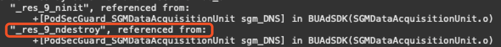

12、[Error Code](#12) 
13、[FAQ](#13) 

## <h2 id='12'>12 Error Code</h2>
Here's brief summary of the predefined error codes:

|Constants|Value|Note|
|---|---|---|
| UPSDKInitErrorDomain |@"UpArpuSDKInitErrorDomain.com.uparpu"|SDK Initialization Error Domain|
| UPSDKInitErrorCodeDataConsentNotSet | 2001 |GDPR consent not set|
| UPSDKInitErrorCodeDataConsentForbidden | 2002 |Initializztion failed due to GDPR being set to forbidden|
| UPADLoadingErrorDomain |@"UPNativeADLoadingErrorDomain.com.uparpu"|Ad loading error domain|
| UPADLoadingErrorCodePlacementStrategyInvalidResponse | 1001 |Placement strategy invalid|
| UPADLoadingErrorCdoePlacementStragetyNetworkError| 1002 |Placement strategy loading error|
| UPADLoadingErrorCodeADOfferLoadingFailed | 1003 |Third party SDK ad loading error|
| UPADLoadingErrorCodePlacementStrategyNotFound | 1004 |Placement Strategy not found|
| UPADLoadingErrorCodeADOfferNotFound | 1005 |No ad found when trying to show ad|
| UPADLoadingErrorCodeShowIntervalWithinPlacementPacing | 1006 |Ad show/request too frequent|
| UPADLoadingErrorCodeShowTimesExceedsHourCap | 1007 |Ad show/request too many time within the same hour|
| UPADLoadingErrorCodeShowTimesExceedsDayCap | 1008 |Ad show/request too many time within the same day|
| UPADLoadingErrorCodeAdapterClassNotFound | 1009 |Adapter not imported|
| UPADLoadingErrorCodeADOfferLoadingTimeout | 10010 |Ad loading timeout|
| UPADLoadingErrorCodeSDKNotInitalizedProperly | 1011 |SDK not initialized properly|
| UPADLoadingErrorCodeDataConsentForbidden | 1012 |Ad loading failed due to GDPR being set to forbidden|
| UPADLoadingErrorCodeThirdPartySDKNotImportedProperly | 1013 |Third party SDK not imported or wrong version's being used|
| UPADLoadingErrorCodeInvalidInputEncountered| 1014 |Invalid parameters encountered(App ID、App Key orPlacement ID being nil)|
| UPADLoadingErrorCodePlacementAdDeliverySwitchOff | 1015 |Ad delivery not turned on for the placement|

## <h2 id='13'>13 FAQ</h2>
### 13.1 App Not Compiles
If your project does not compile and the error message issued by Xcode contains something like **"Undefined symbols for architecture..."** and/or **"ld: symbol(s) not found for architecture..."**:

you are missing some modules in your project; to resolve this kind of issues, use the error message listed in Xcode to find the missing modules and add them into your project:

In the logs listed in Xcode, you'll probably find messages like **"some_symbols", referenced from:**, use **"some_symbols"** to find what modules you're missing. We give some examples here:

Here the undefined symbols are **\_res\_9\_ninit** and **\_res\_9\_ndestroy**, search **Google** or **Baidu** you'll find that these two symbols are defined in the **libresolv.9.tbd** module; so to resolv this issue, just add **libresolv.9.tbd** to your project. Here's how:

1) navigate to **Build Settings**, expand the **Link Binary With Libraries** section: 

2) click the **+** button below, and in the popup, enter **libresolv.9.tbd**, and add **libresolv.9.tbd** lib to your project by selecting it and click the **Add** button:

Here's another example.

After some searches you'll find that the missing symbols(**\_xmlStrlen** and **\_xmlBufferLength**, for example) are defined in **libxml2.tbd**, adding it to your project by walking through the steps listed above will resolve this issue.

### 13.2 App Crashes on Launching
App crashes on launching because you are missing some project configurations. We give some examples here:

1) Missing **-ObjC** flag in **Other Linker Flags** in **Build Settings**:

If you run into this error, do as follows:
Navigate to **Build Settings** in Xcode, in the search box, enter **Other Linker Flags** and double click the row marked **Other Linker Flags**, in the popup click **+** and enter **-ObjC**:

**NOTE**: **Linker Flags** are case sensitive and the letters O and C are **UPPER CASE** here. 

Here's another crash:

You encounter this crash because you are integrating Admob's SDK in your project and don't have app id configured in you Info.plist; try this:

**NOTE: Make sure you use your own Admob app id instead of the one shown in the picture above.**

### 13.3 App Fails to Load Ad
Your app might fail to load ad due to various reasons. We give some examples here:

If your app fail to load ad and the error message displayed in the console contains something like **This might be du to ... SDK not being imported or it's imported but a unsupported version is being used.**, it because you are missing some third party SDK in your project. 
Here's an example

You are missing TouTiao's SDK here, which consists of **BUAdSDK.framework** and **BUAdSDK.bundle**. Adding this two files into your project will resolve this issue.

If the error message contains something like **Adapter initialization failed**, it is because you are missing specific adapter framework in your project. See what format for which ad network you're loading and add the missing adapter into your project.

