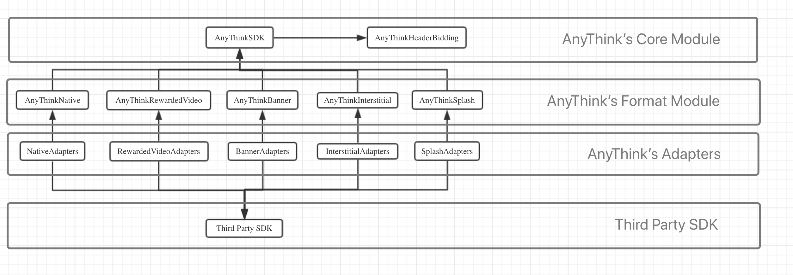
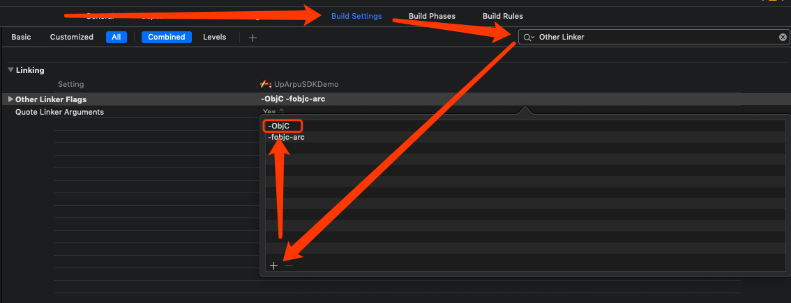
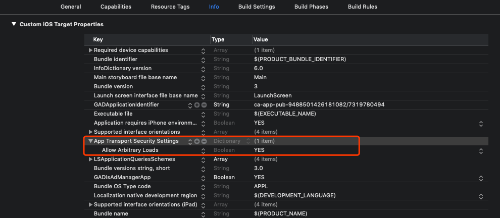
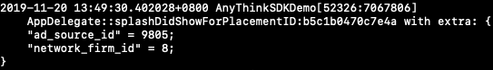
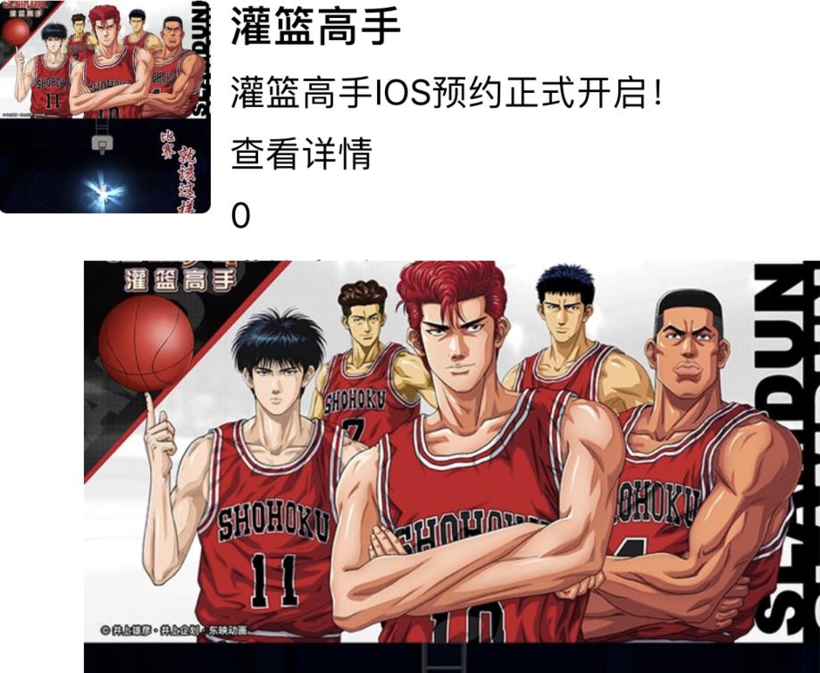

# Integrating AnyThinkSDK for iOS

1、[Introduction](#2)<br>
2、[Get Started](#1)<br>
3、[Implement Splash](#3)<br>
4、[Implement Rewarded Video](#4)<br>
5、[Implement Interstitial](#5)<br>
6、[Implement Banner](#6)<br>
7、[Implement Native](#7)<br>
8、[Implement Native Banner](#8)<br>
9、[Implement Native Splash](#9)<br>
10、[On Header Bidding](#10)<br>
11、[On GDPR](#11)<br>

## <h2 id='2'>1 Introduction</h2>
This document walks you through the process of integrating AnyThinkSDK for iOS in a step-by-step manner.

## 1.1 Supported Ad Formats

AnyThinkSDK supports native, rewarded video, banner, interstitial and splash ads.

## 1.2 AnyThinkSDK Architecture
  


As you can see in the diagram above, the entire SDK can be devided into three layers(apart from Third Party SDK, which, technically, doesn't belong to AnyThinkSDK). When integrating AnyThinkSDK, import these module as decribed below:

|Layer|Required|
|----|----|
|AnyThink's Core Module|You have to import these two frameworks into your project regardless of what third party's what format you would like to include.|
|AnyThink's Format Module|Only import the modules for the formats you would like to include and leave out those you don't need, see the example below.|
|AnyThink's Adapters|Only import the modules for the formats for the thrid party networks you would like to include and leave out those you don't need, see the example below.|
|Third Party SDK|Only import the modules for the third party networks you would like to include and leave out those you don't need, see the example below.|

**Example:** 
Suppose you need to integrate Admob's rewarded video & interstitial, and Facebook's rewarded video, according to the rules above, the frameworks you need to import into your project are listed below:

|Layer|Framework Needed|
|----|----|
|AnyThink's Core Module|AnyThinkSDK.framework</br> AnyThinkHeaderBidding.framework|
|AnyThink's Format Module|AnyThinkInterstitial.framework</br> AnyThinkRewardedVideo.framework|
|AnyThink's Adapters|AnyThinkAdmobRewardedVideoAdapter.framework</br>AnyThinkAdmobInterstitialAdapter.framework</br>AnyThinkFacebookRewardedVideoAdapter.framework|
|Third Party SDK|GoogleMobileAds.framework</br>PersonalizedAdConsent.framework</br>FBAudienceNetwork.framework</br>FBAudienceNetworkBiddingKit.framework</br>FBSDKCoreKit.framework|
  
### 1.3 TopOn SDK Integration Self Check

#### 1.3.1 SDK Core framework
 
```
AnyThinkSDK.framework
AnyThinkSDK.bundle
```

#### 1.3.2 Format Relay framework

```
Native：AnyThinkNative.framework 
Banner：AnyThinkBanner.framework 
Interstitial：AnyThinkInterstitial.framework 
RewardedVideo：AnyThinkRewardedVideo.framework 
Splash：AnyThinkSplash.framework 
```

#### 1.3.3 HeaderBidding Relay framework
(use headerBidding have to integration)
```
AnyThinkHeaderBidding.framework 
```

#### 1.3.4 ThirdNetwork Relay framework

```
(network).framework
(network).bundle
```
(Example：Use Facebook and TT ad，you should import Facebook's FBSDKCoreKit.framework/FBAudienceNetwork.framework/FBAudienceNetworkBiddingKit.framework and TT's BUAdSDK.bundle/BUAdSDK.framework）  
<h2 id='1'>2 Get Started</h2>

### 2.1 Prerequisites

<li>Use Xcode 10 or higher</li>
<li>Target iOS 8.0 or higher</li>


### 2.2 Import Core(Base) Framework
The core module contains the following frameworks and resource bundle files, just drag&drop them into Xcode.

|File|Note|
|---|---|
|AnyThinkSDK.framework|Base framework|
|AnyThinkSDK.bundle|Resource bundle|
|AnyThinkHeaderBiding.framework|Header bidding module|
|TraminiSDK.framework|Error messages collecting module|

**NOTE:** Since **AnyThinkSDK** does not support cocoapods, framewroks whose name start with the prefex AnyThink have to be manually downloaded and imported into your project whereas third party SDK can be integrated using cocoapods if supported.

### 2.3 Configure Build Settings and Info.plist

1) In Xcode, navigate to **Build Settings**, search for **Other Linker Flags** and add **-ObjC**(the letters O and C are **UPPER CASE** here), note that **Linker Flags** are case sensitive:

If you don't see the popup as the picture above, just double click the row marked **Other Linker Flags**.<br><br>
2) Add the **NSAllowsArbitraryLoads** exceptions to your app's Info.plist file to disable ATS restrictions.

### 2.4 Import Third Party SDK
The table below gives a brief summary of third party SDKs. Only import those of the ad networks you would like to integrate.

|Network|SDK Package Contents|Current Version Supported by **TopOn**|Download Link|Reference Website|Note|    
|---|---|---|---|---|---|   
|Facebook|FBAudienceNetwork.framework<br> FBAudienceNetworkBiddingKit.framework <br>FBSDKCoreKit.framework<br>|v5.5.1|https://developers.facebook.com/docs/audience-network/download#ios|https://developers.facebook.com/docs/audience-network/ios|测试机需安装并登录Facebook客户端才能请求到广告。|
|Admob|GoogleMobileAds.framework<br>PersonalizedAdConsent.framework|v7.52.0|https://support.google.com/admob/answer/2993059?hl=en|https://developers.google.com/admob/ios/quick-start|Admob requires that **app id be configured in the Info.plist of your project**; for more information please refer to <a href="https://developers.google.com/admob/ios/quick-start#update\_your\_infoplist">Admob's website</a>.|
| Inmobi |InMobiSDK.framework|v7.3.1|https://support.inmobi.com/monetize/ios-guidelines/||||
| Flurry |libFlurryAds\_1.0.0.a<br>libFlurry\_9.0.0.a|231\_9.0.0|https://dev.flurry.com/admin/applications||||
| Applovin |AppLovinSDK.framework<br>AppLovinSDKResources.bundle|v6.10.0|https://dash.applovin.com/docs/integration#iosIntegration||||
| Mintegral |MTGSDK.framework<br> MTGSDKBidding.framework<br>MTGSDKReward.framework <br> MTGSDKInterstitialVideo.framework <br> MTGSDKInterstitial.framework|v5.8.7|http://cdn-adn.rayjump.com/cdn-adn/v2/markdown\_v2/index.html?file=sdk-m\_sdk-ios&lang=en||||
| Mopub |MobPowerNative.framework <br> MobPowerSDK.framework| v5.10.0 |https://github.com/mopub||||
| GDT |libGDTMobSDK.a|v4.11.2|https://e.qq.com/dev/index.html||||
| Chartboost |Chartboost.framework| v8.0.3 | https://dashboard.chartboost.com/tools/sdk	||||
| Tapjoy |Tapjoy.framework <br> TapjoyResources.bundle| v12.3.4 |||||
| Ironsource |IronSource.framework|v6.10.0|https://developers.ironsrc.com/sdk-repository/||||
| UnityAds |UnityAds.framework| v3.4.0 |https://github.com/Unity-Technologies/unity-ads-ios/releases/tag/3.0.3||||
| Vungle |VungleSDK.framework|v6.4.6|||||
| Adcolony |AdColony.framework|v4.1.0.0|https://github.com/AdColony||||
|TouTiao|BUAdSDK.framework<br>BUAdSDK.bundle|v2.4.6.7|http://ad.toutiao.com/union/media/union/download|||
| Oneway |Oneway|v2.1.0|||||
| Appnext |AppnextNativeAdsSDK<br>AppnextIOSSDK| v1.9.3 |https://developers.appnext.com/docs/ios-sdk-installation||||
| Baidu |BaiduMobAdSDK.framework<br> baidumobadsdk.bundle|v4.6.7|https://mssp.baidu.com/bqt/appco.html#/union/download/sdk||||
|Nend|NendAd.framework <br> NendAdResource.bundle|v5.3.1|https://github.com/fan-ADN||||
| Maio |Maio.framework|v1.5.0|https://github.com/imobile-maio||||
| Yeahmobi |CTSDK.framework|v3.2.0|||||  
| sigmob |WindSDK.framework<br>sigmob.bundle|v2.15.2|||||
|KS|KSAdSDK.framework <br> KSAdSDK.bundle|v2.5.2.12|Additional third-party libraries that need to be introduced：<br>AFNetworking/Godzippa/MJExtension/SDWebImage||||
|Ogury|OMSDK_Oguryco.framework<br>OguryAds.framework<br>OguryConsentManager.framework|1.0.3|||No way of setting GDPR consent without presenting a view controller.||

You can use CocoaPods to import third party SDKs or you can download and import them manually.

<p id='network_firm_id_table'></p>
An id(NSInteger) has been assigned to every network supported by AnyThinkSDK, see the table below for more details:

| Network Name| NETWORK FIRM ID|
|---|---|
|Facebook | 1 |
|Admob | 2 |
|Inmobi | 3 | 
|Flurry| 4 | 
|Applovin| 5 | 
|Mintegral | 6 |
|Mopub | 7 |
|GDT | 8|
|Chartboost | 9| 
|Tapjoy | 10 |
|Ironsource | 11|
|UnityAds | 12 |
|Vungle | 13 | 
|Adcolony | 14 | 
|TouTiao|15|
|玩转互联 | 16 |
|Oneway|17|
|MobPower | 18 |
|金山云 | 19 |
|Yeahmobi|20|
|Appnext|21|
|Baidu|22|
|Nend|23|
|Maio|24|
|KS|28|
|Sigmob|29|
|Ogury|36|

### 2.4 Initialize the SDK

It's recommanded that you should initialize **AnyThinkSDK** in the **application:didFinishLaunchingWithOptions:** method of your **AppDelegate**(You have to initialize the SDK before requesting any ad):

<pre><code>- (BOOL)application:(UIApplication *)application didFinishLaunchingWithOptions:(NSDictionary *)launchOptions {
	 [ATAPI setLogEnabled:YES];<span style="color:green">//Turn on debug logs</span>
    [[ATAPI sharedInstance] startWithAppID:@"a5acc73c25fbf5" appKey:@"4f7b9ac17decb9babec83aac078742c7"];
    return YES;
}</code></pre>

### 2.5 Use AnyThink's Sample Ad Placements for Testing
The quickest way to test ad functionalities is to use **AnyThinkSDK** provided test placements, which are listed below:

|Ad Format|Placement ID|
|---|---|
|Rewarded Video|b5b44a0f115321|
|Interstitial|b5bacad26a752a|
|Banner|b5bacaccb61c29|
|Native Banner|b5b0f5663c6e4a|
|Splash|b5c1b048c498b9|
|Native Splash| b5b0f5663c6e4a |
|Native|b5b0f5663c6e4a|

Note: These placements are associated with **AppID** a5b0e8491845b3 and **AppKey** 7eae0567827cfe2b22874061763f30c9.
After testing, you have to change these IDs into those created under your own **TopOn** account.

## <h2 id='3'>3 Implement Splash</h2>
Before you continue, make sure you've walked through the steps listed in the **Get Started** section.

### 3.1 Import Splash Framework
Drag&drop **AnyThinkSplash.framework** into your project. Apart from **AnyThinkSplash.framework**, you need to import the adapter frameworks for the third party ad networks you would like to integrate; Currently **AnyThinkSDK** supports the following networks(their adapter frameworks are also listed here):

|Third Party Ad Network|Adapter Framework|
|---|---|
|TouTiao|AnyThinkTTSplashAdapter.framework|
|GDT|AnyThinkGDTSplashAdapter.framework|
|Baidu|AnyThinkBaiduSplashAdapter.framework|
|Sigmob|AnyThinkSigmobSplashAdapter.framework|

### 3.1 Load and Show Splash
The best spot to load&show splash ad is the application entry point, which is the **application:didFinishLaunchingWithOptions:** method of your **AppDelegate**.
Splash's load and show functionalities are united into a single api, you can load&show a splash ad using the following code:

<pre><code>- (BOOL)application:(UIApplication *)application didFinishLaunchingWithOptions:(NSDictionary *)launchOptions {
    [ATAPI setLogEnabled:YES];
    [[ATAPI sharedInstance] startWithAppID:@"a5b0e8491845b3" appKey:@"7eae0567827cfe2b22874061763f30c9" error:nil];
    [self.window makeKeyAndVisible];
    [[ATAdManager sharedManager] loadADWithPlacementID:@"b5c1b048c498b9" extra:@{kATSplashExtraTolerateTimeoutKey:@5.5} customData:nil delegate:self window:self.window containerView:nil];
    return YES;
}</code></pre>

**NOTE**: Call **makeKeyAndVisible** on **self.window** before you load&show splash:[self.window makeKeyAndVisible];

### 3.2 Implement Splash Delegates

You can implement **ATSplashDelegate**'s methods to get notified on the various splash ad events:<br>

<pre><code>
#pragma mark - AT Splash Delegate method(s)
-(void) didFinishLoadingADWithPlacementID:(NSString *)placementID {
    NSLog(@"AppDelegate::didFinishLoadingADWithPlacementID:%@", placementID);
}

-(void) didFailToLoadADWithPlacementID:(NSString*)placementID error:(NSError*)error {
    NSLog(@"AppDelegate::didFailToLoadADWithPlacementID:%@ error:%@", placementID, error);
}

-(void)splashDidShowForPlacementID:(NSString*)placementID extra:(NSDictionary*)extra {
    NSLog(@"AppDelegate::splashDidShowForPlacementID:%@ extra:%@", placementID, extra);
}

-(void)splashDidClickForPlacementID:(NSString*)placementID extra:(NSDictionary*)extra {
    NSLog(@"AppDelegate::splashDidClickForPlacementID:%@ extra:%@", placementID, extra);
}

-(void)splashDidCloseForPlacementID:(NSString*)placementID extra:(NSDictionary*)extra {
    NSLog(@"AppDelegate::splashDidCloseForPlacementID:%@ extra:%@", placementID, extra);
}
</code></pre>

**Note:**The trailing extra parameter contains ad network specific info, which, for splash ad, is passed using **kATSplashDelegateExtraNetworkIDKey** and **kATSplashDelegateExtraAdSourceIDKey** as keys; see the pic below for an example:



Refer to [Network Firm Id Table](#network\_firm\_id\_table) for more info on network firm id.

## <h2 id='4'>4 Implement Rewarded Video</h2>
Before you continue, make sure you've walked through the steps listed in the [Get Started](#1) section.
### 4.1 Import Rewarded Video Framework
Drag&drop **AnyThinkRewardedVideo.framework** into your project. Apart from **AnyThinkRewardedVideo.framework**, you need to import the adapter frameworks for the third party ad networks you would like to integrate; Currently **AnyThinkSDK**'s rewarded video supports the following networks(their adapter frameworks are also listed here):

|Third Party Ad Network|Adapter Framework|
|---|---|
|Facebook|AnyThinkFacebookRewardedVideoAdapter.framework|
|Admob|AnyThinkAdmobRewardedVideoAdapter.framework|
|Flurry|AnyThinkFlurryRewardedVideoAdapter.framework|
|Applovin|AnyThinkApplovinRewardedVideoAdapter.framework|
|GDT|AnyThinkGDTRewardedVideoAdapter.framework|
|Baidu|AnyThinkBaiduRewardedVideoAdapter.framework|
|TouTiao|AnyThinkTTRewardedVideoAdapter.framework|
|Nend|AnyThinkNendRewardedVideoAdapter.framework|
|Maio|AnyThinkMaioRewardedVideoAdapter.framework|
|AppNext|AnyThinkAppNextRewardedVideoAdapter.framework|
|Yeahmobi|AnyThinkYeahmobiRewardedVideoAdapter.framework|
|Oneway|AnyThinkOnewayRewardedVideoAdapter.framework|
|Mintegral|AnyThinkMintegralRewardedVideoAdapter.framework|
|Mopub|AnyThinkMopubRewardedVideoAdapter.framework|
|Vungle|AnyThinkVungleRewardedVideoAdapter.framework|
|Ironsource|AnyThinkIronSourceRewardedVideoAdapter.framework|
|Tapjoy|AnyThinkTapjoyRewardedVideoAdapter.framework|
|UnityAds|AnyThinkUnityAdsRewardedVideoAdapter.framework|
|Chartboost|AnyThinkChartboostRewardedVideoAdapter.framework|
|Inmobi|AnyThinkInmobiRewardedVideoAdapter.framework|
|Adcolony|AnyThinkAdcolonyRewardedVideoAdapter.framework|
|Sigmob|AnyThinkSigmobRewardedVideoAdapter.framework|
|KS|AnyThinkKSRewardedVideoAdapter.framework|

### 4.2 Load Rewarded Video
Make your view controller confirm to **ATRewardedVideoDelegate**:
<pre><code>@interface ATRewardedVideoViewController()\<ATRewardedVideoDelegate\>
//Other properties&methods declarations
@end</code></pre>

Load rewarded video ad like this:
**NOTE**:When loading Facebook ads, be sure to pass in userid to get the video callback.
<pre><code>[[ATAdManager sharedManager] loadADWithPlacementID:@"your rv placement id" extra:@{kATAdLoadingExtraUserIDKey:@"test\_user\_id"} delegate:self];</code></pre>

To get notified on various ad loading event, you can implemente the methods in ad loading delegate:
<pre><code>#pragma mark - loading delegate
-(void) didFinishLoadingADWithPlacementID:(NSString *)placementID {
    NSLog(@"RV Demo: didFinishLoadingADWithPlacementID");
}

-(void) didFailToLoadADWithPlacementID:(NSString* )placementID error:(NSError *)error {
    NSLog(@"RV Demo: failed to load:%@", error);
}</code></pre>

### 4.3 Check If Rewarded Video's Ready
You can check if rewarded video's ready for a placement as below:
<pre><code>
if ([[ATAdManager sharedManager] rewardedVideoReadyForPlacementID:@"your rv placement id"]) {
    //Show rv here
} else {
    //Load rv here
}
</code></pre>

### 4.4 Show Rewarded Video
After rewarded video ad has been successfully loaded, you can call the showing API to show it:
 
<pre><code>-(void) showAD {
    [[ATAdManager sharedManager] showRewardedVideoWithPlacementID:@"rv_placement_id" inViewController:self delegate:self];
}</code></pre>

### 4.5 Implement Rewarded Video Delegates
You can implement the methods defined in rewarded video delegate to get notified on various rewarded video event:
<pre><code>#pragma mark - showing delegate
-(void) rewardedVideoDidRewardSuccessForPlacemenID:(NSString *)placementID extra:(NSDictionary *)extra{
    NSLog(@"ATRewardedVideoVideoViewController::rewardedVideoDidRewardSuccessForPlacemenID:%@ extra:%@",placementID,extra);
}

-(void) rewardedVideoDidStartPlayingForPlacementID:(NSString *)placementID extra:(NSDictionary *)extra {
    NSLog(@"ATRewardedVideoVideoViewController::rewardedVideoDidStartPlayingForPlacementID:%@ extra:%@", placementID, extra);
}

-(void) rewardedVideoDidEndPlayingForPlacementID:(NSString*)placementID extra:(NSDictionary *)extra {
    NSLog(@"ATRewardedVideoVideoViewController::rewardedVideoDidEndPlayingForPlacementID:%@ extra:%@", placementID, extra);
}

-(void) rewardedVideoDidFailToPlayForPlacementID:(NSString*)placementID error:(NSError*)error extra:(NSDictionary *)extra {
    NSLog(@"ATRewardedVideoVideoViewController::rewardedVideoDidFailToPlayForPlacementID:%@ error:%@ extra:%@", placementID, error, extra);
}

-(void) rewardedVideoDidCloseForPlacementID:(NSString*)placementID rewarded:(BOOL)rewarded extra:(NSDictionary *)extra {
    NSLog(@"ATRewardedVideoVideoViewController::rewardedVideoDidCloseForPlacementID:%@, rewarded:%@ extra:%@", placementID, rewarded ? @"yes" : @"no", extra);
}

-(void) rewardedVideoDidClickForPlacementID:(NSString*)placementID extra:(NSDictionary *)extra {
    NSLog(@"ATRewardedVideoVideoViewController::rewardedVideoDidClickForPlacementID:%@ extra:%@", placementID, extra);
}</code></pre>

**Note:**The trailing extra parameter contains ad network specific info, which, for rewarded video ad, is passed using **kATRewardedVideoCallbackExtraAdsourceIDKey** and **kATRewardedVideoCallbackExtraNetworkIDKey** as keys; here's an example of extra:

<pre><code>{
    "ad_source_id" = 9805;
    "network_firm_id" = 8;
}</code></pre>

Refer to [Network Firm Id Table](#network\_firm\_id\_table) for more info on network firm id.

## <h2 id='5'>5 Implement Interstitial</h2>
Before you continue, make sure you've walked through the steps listed in the [Get Started](#1) section.
 
### 5.1 Import Interstitial Framework
Drag&drop **AnyThinkInterstitial.framework** into your project. Apart from **AnyThinkInterstitial.framework**, you need to import the adapter frameworks for the third party ad networks you would like to integrate; Currently **AnyThinkSDK**'s interstitial supports the following networks(their adapter frameworks are also listed here):

|Third Party Ad Network|Adapter Framework|
|---|---|
|Facebook|AnyThinkFacebookInterstitialAdapter.framework|
|Admob|AnyThinkAdmobInterstitialAdapter.framework|
|Flurry|AnyThinkFlurryInterstitialAdapter.framework|
|Applovin|AnyThinkApplovinInterstitialAdapter.framework|
|GDT|AnyThinkGDTInterstitialAdapter.framework|
|Baidu|AnyThinkBaiduInterstitialAdapter.framework|
|TouTiao|AnyThinkTTInterstitialAdapter.framework|
|Nend|AnyThinkNendInterstitialAdapter.framework|
|Maio|AnyThinkMaioInterstitialAdapter.framework|
|AppNext|AnyThinkAppNextInterstitialAdapter.framework|
|Yeahmobi|AnyThinkYeahmobiInterstitialAdapter.framework|
|Oneway|AnyThinkOnewayInterstitialAdapter.framework|
|Mintegral|AnyThinkMintegralInterstitialAdapter.framework|
|Mopub|AnyThinkMopubInterstitialAdapter.framework|
|Vungle|AnyThinkVungleInterstitialAdapter.framework|
|Ironsource|AnyThinkIronSourceInterstitialAdapter.framework|
|Tapjoy|AnyThinkTapjoyInterstitialAdapter.framework|
|UnityAds|AnyThinkUnityAdsInterstitialAdapter.framework|
|Chartboost|AnyThinkChartboostInterstitialAdapter.framework|
|Inmobi|AnyThinkInmobiInterstitialAdapter.framework|
|Adcolony|AnyThinkAdcolonyInterstitialAdapter.framework|
|Sigmob|AnyThinkSigmobInterstitialAdapter.framework|
|KS|AnyThinkKSInterstitialAdapter.framework|

### 5.2 Load Interstitial
Make your view controller confirm to **ATInterstitialDelegate**:
<pre><code>@interface ATInterstitialViewController()\<ATInterstitialDelegate\>
//Other properties&methods declarations
@end</code></pre>

Load Interstitial ad like this:
<pre><code>[[ATAdManager sharedManager] loadADWithPlacementID:@"your interstitial placement id" extra:nil delegate:self];</code></pre>

To get notified on various ad loading event, you can implemente the methods in ad loading delegate:
<pre><code>#pragma mark - loading delegate
-(void) didFinishLoadingADWithPlacementID:(NSString *)placementID {
    NSLog(@"Interstitial Demo: didFinishLoadingADWithPlacementID");
}

-(void) didFailToLoadADWithPlacementID:(NSString* )placementID error:(NSError *)error {
    NSLog(@"Interstitial Demo: failed to load:%@", error);
}</code></pre>

### 5.3 Check If Interstitial's Ready
You can check if interstitial's ready for a placement as below:
<pre><code>if ([[ATAdManager sharedManager] interstitialReadyForPlacementID:@"your interstitial placement id"]) {
    //Show interstitial here
} else {
    //Load interstitial here
}
</code></pre>

### 5.4 Show Interstitial
After interstitial ad has been successfully loaded, you can call the showing API to show it:
 
<pre><code>-(void) showAD {
    [[ATAdManager sharedManager] showInterstitialWithPlacementID:@"interstitial_placement_id" inViewController:self delegate:self];
}</code></pre>

### 5.5 Implement Interstitial Delegates
You can implement the methods defined in **ATInterstitialDelegate** to get notified on various interstitial event:
<pre><code>#pragma mark - showing delegate
-(void) interstitialDidShowForPlacementID:(NSString *)placementID extra:(NSDictionary *)extra {
    NSLog(@"ATInterstitialViewController::interstitialDidShowForPlacementID:%@ extra:%@", placementID, extra);
}

-(void) interstitialFailedToShowForPlacementID:(NSString*)placementID error:(NSError*)error extra:(NSDictionary *)extra {
    NSLog(@"ATInterstitialViewController::interstitialFailedToShowForPlacementID:%@ error:%@ extra:%@", placementID, error, extra);
}

-(void) interstitialDidFailToPlayVideoForPlacementID:(NSString*)placementID error:(NSError*)error extra:(NSDictionary*)extra {
    NSLog(@"ATInterstitialViewController::interstitialDidFailToPlayVideoForPlacementID:%@ error:%@ extra:%@", placementID, error, extra);
}

-(void) interstitialDidStartPlayingVideoForPlacementID:(NSString*)placementID extra:(NSDictionary *)extra {
    NSLog(@"ATInterstitialViewController::interstitialDidStartPlayingVideoForPlacementID:%@ extra:%@", placementID, extra);
}

-(void) interstitialDidEndPlayingVideoForPlacementID:(NSString*)placementID extra:(NSDictionary *)extra {
    NSLog(@"ATInterstitialViewController::interstitialDidEndPlayingVideoForPlacementID:%@ extra:%@", placementID, extra);
}

-(void) interstitialDidCloseForPlacementID:(NSString*)placementID extra:(NSDictionary *)extra {
    NSLog(@"ATInterstitialViewController::interstitialDidCloseForPlacementID:%@ extra:%@", placementID, extra);
}

-(void) interstitialDidClickForPlacementID:(NSString*)placementID extra:(NSDictionary *)extra {
    NSLog(@"ATInterstitialViewController::interstitialDidClickForPlacementID:%@ extra:%@", placementID, extra);
}</code></pre>

**Note:**The trailing extra parameter contains ad network specific info, which, for interstitial ad, is passed using **kATInterstitialDelegateExtraNetworkIDKey** and **kATInterstitialDelegateExtraAdSourceIDKey** as keys; here's an example of extra:

<pre><code>{
    "ad_source_id" = 9805;
    "network_firm_id" = 8;
}</code></pre>

Refer to [Network Firm Id Table](#network\_firm\_id\_table) for more info on network firm id.

## <h2 id='6'>6 Implement Banner</h2>
Before you continue, make sure you've walked through the steps listed in the [Get Started](#1) section.

### 6.1 Import Banner Framework
Drag&drop **AnyThinkBanner.framework** into your project. Apart from **AnyThinkBanner.framework**, you need to import the adapter frameworks for the third party ad networks you would like to integrate; Currently **AnyThinkSDK**'s banner supports the following networks(their adapter frameworks are also listed here):

|Third Party Ad Network|Adapter Framework|
|---|---|
|Facebook|AnyThinkFacebookBannerAdapter.framework|
|Admob|AnyThinkAdmobBannerAdapter.framework|
|Flurry|AnyThinkFlurryBannerAdapter.framework|
|Applovin|AnyThinkApplovinBannerAdapter.framework|
|GDT|AnyThinkGDTBannerAdapter.framework|
|Baidu|AnyThinkBaiduBannerAdapter.framework|
|TouTiao|AnyThinkTTBannerAdapter.framework|
|Nend|AnyThinkNendBannerAdapter.framework|
|AppNext|AnyThinkAppNextBannerAdapter.framework|
|Yeahmobi|AnyThinkYeahmobiBannerAdapter.framework|
|Oneway|AnyThinkOnewayBannerAdapter.framework|
|Mopub|AnyThinkMopubBannerAdapter.framework|
|Mopub|AnyThinkInmobiBannerAdapter.framework|

### 6.2 Load Banner

Make your view controller confirm to **ATBannerDelegate**:
<pre><code>@interface ATBannerViewController()\<ATBannerDelegate\>
//Other properties&methods declarations
@end</code></pre>

Load banner ad like this:
<pre><code>[[ATAdManager sharedManager] loadADWithPlacementID:@"your banner placement id" extra:nil delegate:self];</code></pre>

To get notified on various ad loading event, you can implemente the methods in ad loading delegate:
<pre><code>#pragma mark - loading delegate
-(void) didFinishLoadingADWithPlacementID:(NSString *)placementID {
    NSLog(@"Banner Demo: didFinishLoadingADWithPlacementID");
}

-(void) didFailToLoadADWithPlacementID:(NSString* )placementID error:(NSError *)error {
    NSLog(@"Banner Demo: failed to load:%@", error);
}</code></pre>

### 6.3 Check If Banner's Ready

You can check if banner's ready for a placement as below:

<pre><code>
if ([[ATAdManager sharedManager] bannerAdReadyForPlacementID:@"your banner placement id"]) {
    //Show banner here
} else {
    //Load banner here
}
</code></pre>

### 6.4 Show Banner
After banner ad has been successfully loaded, you can call the showing API to show it:
 
<pre><code>-(void) showBanner {
    if ([[ATAdManager sharedManager] bannerAdReadyForPlacementID:@"banner placement id"]) {
    //Retrieve banner view
        ATBannerView *bannerView = [[ATAdManager sharedManager] retrieveBannerViewForPlacementID:@"banner placement id"];
        bannerView.delegate = self;
        bannerView.translatesAutoresizingMaskIntoConstraints = NO;
        bannerView.tag = tag;
        [self.view addSubview:bannerView];
        //Layour banner
        [self.view addConstraint:[NSLayoutConstraint constraintWithItem:self.view attribute:NSLayoutAttributeCenterX relatedBy:NSLayoutRelationEqual toItem:bannerView attribute:NSLayoutAttributeCenterX multiplier:1.0f constant:.0f]];
        [self.view addConstraint:[NSLayoutConstraint constraintWithItem:bannerView attribute:NSLayoutAttributeTop relatedBy:NSLayoutRelationEqual toItem:self.view attribute:NSLayoutAttributeTop multiplier:1.0f constant:CGRectGetHeight([UIApplication sharedApplication].statusBarFrame) + CGRectGetHeight(self.navigationController.navigationBar.frame)]];
        [self.view addConstraint:[NSLayoutConstraint constraintWithItem:bannerView attribute:NSLayoutAttributeWidth relatedBy:NSLayoutRelationEqual toItem:nil attribute:NSLayoutAttributeNotAnAttribute multiplier:1.0f constant:_adSize.width]];
        [self.view addConstraint:[NSLayoutConstraint constraintWithItem:bannerView attribute:NSLayoutAttributeHeight relatedBy:NSLayoutRelationEqual toItem:nil attribute:NSLayoutAttributeNotAnAttribute multiplier:1.0f constant:_adSize.height]];
    } else {
        NSLog(@"Banner ad's not ready for placementID:%@", _placementIDs[_name]);
    }
}</code></pre>

### 6.5 Implemente Banner Delegates
You can implement the methods defined in **ATBannerDelegate** to get notified on various banner event:
<pre><code>-(void) bannerView:(ATBannerView\*)bannerView didShowAdWithPlacementID:(NSString\*)placementID extra:(NSDictionary \*)extra{
    NSLog(@"ATBannerViewController::bannerView:didShowAdWithPlacementID:%@ with extra: %@", placementID,extra);
}
-(void) bannerView:(ATBannerView\*)bannerView didClickWithPlacementID:(NSString\*)placementID extra:(NSDictionary \*)extra{
    NSLog(@"ATBannerViewController::bannerView:didClickWithPlacementID:%@ with extra: %@", placementID,extra);
}
-(void) bannerView:(ATBannerView\*)bannerView didCloseWithPlacementID:(NSString\*)placementID extra:(NSDictionary \*)extra{
    NSLog(@"ATBannerViewController::bannerView:didCloseWithPlacementID:%@ with extra: %@", placementID,extra);
}
-(void) bannerView:(ATBannerView\*)bannerView didAutoRefreshWithPlacement:(NSString\*)placementID extra:(NSDictionary \*)extra{
    NSLog(@"ATBannerViewController::bannerView:didAutoRefreshWithPlacement:%@ with extra: %@", placementID,extra);
}
-(void) bannerView:(ATBannerView\*)bannerView failedToAutoRefreshWithPlacementID:(NSString\*)placementID  extra:(NSDictionary \*)extra error:(NSError\*)error {
    NSLog(@"ATBannerViewController::bannerView:failedToAutoRefreshWithPlacementID:%@ error:%@", placementID, error);
}</code></pre>

**Note:**The trailing extra parameter contains ad network specific info, which, for banner ad, is passed using **kATBannerDelegateExtraNetworkIDKey** and **kATBannerDelegateExtraAdSourceIDKey** as keys; here's an example of extra:

<pre><code>{
    "ad_source_id" = 9805;
    "network_firm_id" = 8;
}</code></pre>

Refer to [Network Firm Id Table](#network\_firm\_id\_table) for more info on network firm id.

## <h2 id='7'>7 Implement Native</h2>

Before you continue, make sure you've walked through the steps listed in the [Get Started](#1) section.

### 7.1 Import Native Framework
Drag&drop **AnyThinkNative.framework** into your project. Apart from **AnyThinkNative.framework**, you need to import the adapter frameworks for the third party ad networks you would like to integrate; Currently **AnyThinkSDK**'s native supports the following networks(their adapter frameworks are also listed here):

|Third Party Ad Network|Adapter Framework|
|---|---|
|Facebook|AnyThinkFacebookNativeAdapter.framework|
|Admob|AnyThinkAdmobNativeAdapter.framework|
|Flurry|AnyThinkFlurryNativeAdapter.framework|
|Applovin|AnyThinkApplovinNativeAdapter.framework|
|GDT|AnyThinkGDTNativeAdapter.framework|
|Baidu|AnyThinkBaiduNativeAdapter.framework|
|TouTiao|AnyThinkTTNativeAdapter.framework|
|Nend|AnyThinkNendNativeAdapter.framework|
|AppNext|AnyThinkAppNextNativeAdapter.framework|
|Yeahmobi|AnyThinkYeahmobiNativeAdapter.framework|
|Oneway|AnyThinkOnewayNativeAdapter.framework|
|Mintegral|AnyThinkMintegralNativeAdapter.framework|
|Mopub|AnyThinkMopubNativeAdapter.framework|

### 7.2 Load Native

Make your view controller confirm to **ATNativeADDelegate**:
<pre><code>@interface ATNativeViewController()\<ATNativeADDelegate\>
//Other properties&methods declarations
@end</code></pre>

<a name="loading_native"></a>
Load native ad like this:
<pre><code>[[ATAdManager sharedManager] loadADWithPlacementID:@"your native placement id" extra:@{kExtraInfoNativeAdSizeKey:[NSValue valueWithCGSize:CGSizeMake(CGRectGetWidth(self.view.bounds), 400.0f)]} delegate:self];</code></pre>


**Note:** The size passed here through **kExtraInfoNativeAdSizeKey** is for GDT & TT's template ad type. Specify a size that equals the ultimate showing size(the size of the **ADFrame** property you pass to **ATNativeADConfiguration** object when showing a native ad), see [Show Native](#showing_native_ad) for more details.

To get notified on various ad loading event, you can implemente the methods in ad loading delegate:
<pre><code>#pragma mark - loading delegate
-(void) didFinishLoadingADWithPlacementID:(NSString *)placementID {
    NSLog(@"Native Demo: didFinishLoadingADWithPlacementID");
}

-(void) didFailToLoadADWithPlacementID:(NSString* )placementID error:(NSError *)error {
    NSLog(@"Native Demo: failed to load:%@", error);
}</code></pre>


### 7.3 Show Native 
<a name="showing_native_ad"></a>
After native ad has been successfully loaded, you can call the showing API to show it:
 
<pre><code>-(void) showAD {
    ATNativeADConfiguration *config = [[ATNativeADConfiguration alloc] init];
    config.ADFrame = CGRectMake(.0f, 64.0f, CGRectGetWidth(self.view.bounds), 400.0f);
    config.delegate = self;
    config.renderingViewClass = [DMADView class];
    DMADView *adView = (DMADView*)[[ATAdManager sharedManager] retriveAdViewWithPlacementID:_placementIDs[_name] configuration:config];
    adView.tag = adViewTag;
    [self.view addSubview:adView];
}</code></pre>

**Note:** If you use GDT or TT's template ad type, to acquire best layout, in **ADFrame** property of the **ATNativeADConfiguration** object here, specify a size that equals to the one you specify through the **kExtraInfoNativeAdSizeKey** in the **extra** parameter when call the loading method above, see [Load Native](#loading_native) for more details.

#### 7.3.1 Implement Custom Native Ad View

To show ad, you have to define a custom ad view that is a subclass of the **ATNativeADView**, which confirms to the **ATNativeRendering** protocol. That means you have to somehow implement the method listed in that protocol. In our demo, we do that by adding the various property, thus confirming to the protocol methods through those getters:
<pre><code>@interface DMADView:ATNativeADView
@property(nonatomic, readonly) UILabel \*advertiserLabel;
@property(nonatomic, readonly) UILabel \*textLabel;
@property(nonatomic, readonly) UILabel \*titleLabel;
@property(nonatomic, readonly) UILabel \*ctaLabel;
@property(nonatomic, readonly) UILabel \*ratingLabel;
@property(nonatomic, readonly) UIImageView \*iconImageView;
@property(nonatomic, readonly) UIImageView \*mainImageView;
@end</code></pre>

There are two things your implementation of the ad view need to do:

1) Create the ui elements for displaying the ad assets**

Subviews creation are done by override the initSubviews method:
 <pre><code>-(void) initSubviews {
    [super initSubviews];
    \_advertiserLabel = [UILabel autolayoutLabelFont:[UIFont boldSystemFontOfSize:15.0f] textColor:[UIColor blackColor] textAlignment:NSTextAlignmentLeft];
    [self addSubview:\_advertiserLabel];
    \_titleLabel = [UILabel autolayoutLabelFont:[UIFont boldSystemFontOfSize:18.0f] textColor:[UIColor blackColor] textAlignment:NSTextAlignmentLeft];
    [self addSubview:\_titleLabel];
    \_textLabel = [UILabel autolayoutLabelFont:[UIFont systemFontOfSize:15.0f] textColor:[UIColor blackColor]];
    [self addSubview:\_textLabel];
    \_ctaLabel = [UILabel autolayoutLabelFont:[UIFont systemFontOfSize:15.0f] textColor:[UIColor blackColor]];
    [self addSubview:\_ctaLabel];
    \_ctaButton = [UIButton autolayoutButtonWithType:UIButtonTypeCustom];
    [self insertSubview:\_ctaButton aboveSubview:\_ctaLabel];
    \_ratingLabel = [UILabel autolayoutLabelFont:[UIFont systemFontOfSize:15.0f] textColor:[UIColor blackColor]];
    [self addSubview:\_ratingLabel];
    \_iconImageView = [UIImageView autolayoutView];
    \_iconImageView.layer.cornerRadius = 4.0f;
    \_iconImageView.layer.masksToBounds = YES;
    \_iconImageView.contentMode = UIViewContentModeScaleAspectFit;
    [self addSubview:\_iconImageView];
    \_mainImageView = [UIImageView autolayoutView];
    \_mainImageView.contentMode = UIViewContentModeScaleAspectFit;
    [self addSubview:_mainImageView];
    self.mediaView.translatesAutoresizingMaskIntoConstraints = NO;
}</code></pre>

These ui elements includes:

| UI name | UI Element | Description |
|----------|----------|-----------|
| titleLabel | UILabel | For the title in the ad assets|
| textLabel | UILabel | For the text in the ad assets|
| ratingLabel | UILabel | For the app rating in the ad assets|
| ctaLabel | UILabel | For the cta text in the ad assets|
| iconImageView | UIImage | For the app icon image in the ad assets|
| mainImageView | UIImage | For the cover image in the ad assets|
| advertiserLabel | UILabel | For showing the advertiser name |
For video ad, there should be an media view to play the video, which has been created by the sdk for you. Some thirt-party show their cover image in the media view but others has both a media view and a image view. For this reason, you are recommended to add the image view for showing the cover image at index 0 in the subviews of your ad view in case it overlays the video playing view.

2) Layout the ui elements in a way that matches the style of your own app design.**

In our sample code, we've been using **autolayout**; the methods used are implemented in catogories of **UIView** and other controls; they are simply thin wrappers around the native **cocoa touch***methods; you can check out the **MTAutolayoutCategories** category for this. When using autolayout, you are recommended to override the makeConstraintsForSubviews and write your layout code there:

<pre><code>-(void) makeConstraintsForSubviews {
    [super makeConstraintsForSubviews];
    NSDictionary *viewsDict = nil;
    if (self.mediaView != nil) {
        viewsDict = @{@"titleLabel":self.titleLabel, @"textLabel":self.textLabel, @"ctaLabel":self.ctaLabel, @"ratingLabel":self.ratingLabel, @"iconImageView":self.iconImageView, @"mainImageView":self.mainImageView, @"mediaView":self.mediaView, @"advertiserLabel":self.advertiserLabel};
    } else {
        viewsDict = @{@"titleLabel":self.titleLabel, @"textLabel":self.textLabel, @"ctaLabel":self.ctaLabel, @"ratingLabel":self.ratingLabel, @"iconImageView":self.iconImageView, @"mainImageView":self.mainImageView, @"advertiserLabel":self.advertiserLabel};
    }
    [self addConstraintsWithVisualFormat:@"|[mainImageView]|" options:0 metrics:nil views:viewsDict];
    [self addConstraintsWithVisualFormat:@"V:[iconImageView][mainImageView]|" options:0 metrics:nil views:viewsDict];
    [self addConstraintWithItem:self.iconImageView attribute:NSLayoutAttributeWidth relatedBy:NSLayoutRelationEqual toItem:self.iconImageView attribute:NSLayoutAttributeHeight multiplier:1.0f constant:.0f];
    [self addConstraintsWithVisualFormat:@"|-15-[iconImageView(90)]-8-[titleLabel]-15-|" options:NSLayoutFormatAlignAllTop metrics:nil views:viewsDict];
    [self addConstraintsWithVisualFormat:@"V:|-15-[titleLabel]-8-[textLabel]-8-[ctaLabel]-8-[ratingLabel]-8-[advertiserLabel]" options:NSLayoutFormatAlignAllLeading | NSLayoutFormatAlignAllTrailing metrics:nil views:viewsDict];
    if (self.mediaView != nil) {
        [self addConstraintsWithVisualFormat:@"|[mediaView]|" options:0 metrics:nil views:viewsDict];
        [self addConstraintsWithVisualFormat:@"V:[iconImageView]-[mediaView]|" options:0 metrics:nil views:viewsDict];
    }
}</code></pre>

You can even use the famous **Masonary** open-source layout kit. Besides, **struts&springs**(frame-based) layout technique is also supported. When using this, you are recommended to override the layoutSubviews method and set the frames of your subviews there.
    It is completely up to you what layout technique to be used. It's just a matter of choice, just feel free to do as pleases you.

#### 7.3.2 Show Native Using Your Custom Native Ad View
To show an ad, you first create a 
**ATNativeADConfiguration** 
instance, set the frame within which you want to show the ad, the class of your custom ad view and the delegate to get notified on the various ad showing event, then you call the **retriveAdViewWithPlacementID:configuration:** method on the singleton instance of **ATAdManager** with placement id and the configuration object you just created as the parameters, that should return you an ad view ready for showing, you just add it to the view on which you want the ad to be shown:

<pre><code>-(void) showAD {
    ATNativeADConfiguration *config = [[ATNativeADConfiguration alloc] init];
    config.ADFrame = CGRectMake(.0f, 64.0f, CGRectGetWidth(self.view.bounds), 400.0f);
    config.delegate = self;
    config.renderingViewClass = [DMADView class];
    DMADView *adView = (DMADView*)[[ATAdManager sharedManager] retriveAdViewWithPlacementID:_placementIDs[_name] configuration:config];
    adView.tag = adViewTag;
    [self.view addSubview:adView];
}</code></pre>

The code above gives you the effect shown below:



### 7.4 Implement Native Delegate
You can implement the methods defined in **ATNativeDelegate** to get notified on various native event:


<pre><code>//Called when user click the ad
-(void) didClickNativeAdInAdView:(ATNativeADView*)adView placementID:(NSString*)placementID extra:(NSDictionary *)extra{
    NSLog(@"ATADShowViewController:: didClickNativeAdInAdView:placementID:%@ with extra: %@", placementID,extra);
}

-(void) didShowNativeAdInAdView:(ATNativeADView*)adView placementID:(NSString*)placementID extra:(NSDictionary *)extra{
    NSLog(@"ATADShowViewController:: didShowNativeAdInAdView:placementID:%@ with extra: %@", placementID,extra);
}</code></pre>

**Note:**The trailing extra parameter contains ad network specific info, which, for native ad, is passed using **kATNativeDelegateExtraNetworkIDKey** and **kATNativeDelegateExtraAdSourceIDKey** as keys; here's an example of extra:

<pre><code>{
    "ad_source_id" = 9805;
    "network_firm_id" = 8;
}</code></pre>

Refer to [Network Firm Id Table](#network\_firm\_id\_table) for more info on network firm id.

## <h2 id='8'>8 Implement Native Banner</h2>
Before you continue, make sure you've walked through the steps listed in the [Get Started](#1) section.

### 8.1 Import Native Framework
Native banner is embeded in native, so the frameworks you need to import are just the same as those of native. Drag&drop **AnyThinkNative.framework** into your project. Apart from **AnyThinkNative.framework**, you need to import the adapter frameworks for the third party ad networks you would like to integrate; Currently **AnyThinkSDK**'s native supports the following networks(their adapter frameworks are also listed here):

|Third Party Ad Network|Adapter Framework|
|---|---|
|Facebook|AnyThinkFacebookNativeAdapter.framework|
|Admob|AnyThinkAdmobNativeAdapter.framework|
|Flurry|AnyThinkFlurryNativeAdapter.framework|
|Applovin|AnyThinkApplovinNativeAdapter.framework|
|GDT|AnyThinkGDTNativeAdapter.framework|
|Baidu|AnyThinkBaiduNativeAdapter.framework|
|TouTiao|AnyThinkTTNativeAdapter.framework|
|Nend|AnyThinkNendNativeAdapter.framework|
|AppNext|AnyThinkAppNextNativeAdapter.framework|
|Yeahmobi|AnyThinkYeahmobiNativeAdapter.framework|
|Oneway|AnyThinkOnewayNativeAdapter.framework|
|Mintegral|AnyThinkMintegralNativeAdapter.framework|
|Mopub|AnyThinkMopubNativeAdapter.framework|

### 8.2 Load Native Banner
Make your view controller confirm to **ATNativeBannerDelegate**:
<pre><code>@interface ATNativeBannerViewController()\<ATNativeBannerDelegate\>
//Other properties&methods declarations
@end</code></pre>

Load native banner ad like this:
<pre><code>[ATNativeBannerWrapper loadNativeBannerAdWithPlacementID:_placementID extra:nil customData:nil delegate:self];</code></pre>

### 8.3 Show Native Banner
After native banner ad has been successfully loaded, you can call the showing API to show it:
 
<pre><code>-(void) showAd {
    ATNativeBannerView *bannerView = [ATNativeBannerWrapper retrieveNativeBannerAdViewWithPlacementID:_placementID extra:@{kATNativeBannerAdShowingExtraAdSizeKey:[NSValue valueWithCGSize:CGSizeMake(CGRectGetWidth([UIScreen mainScreen].bounds), 80.0f)], kATNativeBannerAdShowingExtraAutorefreshIntervalKey:@10.0f, kATNativeBannerAdShowingExtraHideCloseButtonFlagKey:@NO, kATNativeBannerAdShowingExtraCTAButtonBackgroundColorKey:[UIColor redColor], kATNativeBannerAdShowingExtraCTAButtonTitleColorKey:[UIColor whiteColor], kATNativeBannerAdShowingExtraCTAButtonTitleFontKey:[UIFont systemFontOfSize:12.0f], kATNativeBannerAdShowingExtraTitleColorKey:[UIColor grayColor], kATNativeBannerAdShowingExtraTitleFontKey:[UIFont systemFontOfSize:12.0f], kATNativeBannerAdShowingExtraTextColorKey:[UIColor lightGrayColor], kATNativeBannerAdShowingExtraTextFontKey:[UIFont systemFontOfSize:10.0f], kATNativeBannerAdShowingExtraBackgroundColorKey:[UIColor whiteColor], kATNativeBannerAdShowingExtraAdvertiserTextFontKey:[UIFont systemFontOfSize:12.0f], kATNativeBannerAdShowingExtraAdvertiserTextColorKey:[UIColor lightGrayColor]} delegate:self];
    bannerView.frame = CGRectMake(.0f, 100.0f, CGRectGetWidth(bannerView.bounds), CGRectGetHeight(bannerView.bounds));
    bannerView.autoresizingMask = UIViewAutoresizingFlexibleWidth;
    [self.view addSubview:bannerView];
}</code></pre>

### 8.4 Implement Native Banner Delegates
<pre><code>#pragma mark - native banner delegate(s)
-(void) didFinishLoadingNativeBannerAdWithPlacementID:(NSString *)placementID {
    NSLog(@"ATNativeBannerViewController::didFinishLoadingNativeBannerAdWithPlacementID:%@", placementID);
}

-(void) didFailToLoadNativeBannerAdWithPlacementID:(NSString*)placementID error:(NSError*)error {
    NSLog(@"ATNativeBannerViewController::didFailToLoadNativeBannerAdWithPlacementID:%@ error:%@", placementID, error);
}

-(void) didShowNativeBannerAdInView:(ATNativeBannerView*)bannerView placementID:(NSString*)placementID extra:(NSDictionary *)extra{
    NSLog(@"ATNativeBannerViewController::didShowNativeBannerAdInView:%@ placementID:%@ with extra: %@",bannerView, placementID,extra);
}

-(void) didClickNativeBannerAdInView:(ATNativeBannerView*)bannerView placementID:(NSString*)placementID extra:(NSDictionary *)extra{
    NSLog(@"ATNativeBannerViewController::didClickNativeBannerAdInView:%@ placementID:%@ with extra: %@",bannerView, placementID,extra);
}

-(void) didClickCloseButtonInNativeBannerAdView:(ATNativeBannerView*)bannerView placementID:(NSString*)placementID extra:(NSDictionary *)extra{
    NSLog(@"ATNativeBannerViewController::didClickCloseButtonInNativeBannerAdView:%@ placementID:%@", bannerView, placementID);
}

-(void) didAutorefreshNativeBannerAdInView:(ATNativeBannerView*)bannerView placementID:(NSString*)placementID extra:(NSDictionary *)extra{
    NSLog(@"ATNativeBannerViewController::didAutorefreshNativeBannerAdInView:%@ placementID:%@ with extra: %@",bannerView, placementID,extra);
}

-(void) didFailToAutorefreshNativeBannerAdInView:(ATNativeBannerView*)bannerView placementID:(NSString*)placementID extra:(NSDictionary *)extra error:(NSError*)error {
    NSLog(@"ATNativeBannerViewController::didFailToAutorefreshNativeBannerAdInView:%@ placementID:%@ error:%@", bannerView, placementID, error);
}</code></pre>

**Note:**The trailing extra parameter contains ad network specific info, which, for native banner ad, is passed using **kATNativeDelegateExtraNetworkIDKey** and **kATNativeDelegateExtraAdSourceIDKey** as keys(the same as those of native ad); here's an example of extra:

<pre><code>{
    "ad_source_id" = 9805;
    "network_firm_id" = 8;
}</code></pre>

Refer to [Network Firm Id Table](#network\_firm\_id\_table) for more info on network firm id.

## <h2 id='9'>9 Implement Native Splash</h2>
Before you continue, make sure you've walked through the steps listed in the [Get Started](#1) section.

### 9.1 Import Native Framework
Native splash is embeded in native, so the frameworks you need to import are just the same as those of native. Drag&drop **AnyThinkNative.framework** into your project. Apart from **AnyThinkNative.framework**, you need to import the adapter frameworks for the third party ad networks you would like to integrate; Currently **AnyThinkSDK**'s native supports the following networks(their adapter frameworks are also listed here):

|Third Party Ad Network|Adapter Framework|
|---|---|
|Facebook|AnyThinkFacebookNativeAdapter.framework|
|Admob|AnyThinkAdmobNativeAdapter.framework|
|Flurry|AnyThinkFlurryNativeAdapter.framework|
|Applovin|AnyThinkApplovinNativeAdapter.framework|
|GDT|AnyThinkGDTNativeAdapter.framework|
|Baidu|AnyThinkBaiduNativeAdapter.framework|
|TouTiao|AnyThinkTTNativeAdapter.framework|
|Nend|AnyThinkNendNativeAdapter.framework|
|AppNext|AnyThinkAppNextNativeAdapter.framework|
|Yeahmobi|AnyThinkYeahmobiNativeAdapter.framework|
|Oneway|AnyThinkOnewayNativeAdapter.framework|
|Mintegral|AnyThinkMintegralNativeAdapter.framework|
|Mopub|AnyThinkMopubNativeAdapter.framework|

### 9.2 Load Native Splash
Make your view controller confirm to **ATNativeSplashDelegate**:
<pre><code>@interface ATNativeSplashViewController()\<ATNativeSplashDelegate\>
//Other properties&methods declarations
@end</code></pre>

Load native splash ad like this:
<pre><code>[ATNativeSplashWrapper loadNativeSplashAdWithPlacementID:@"native splash placement id" extra:@{kExtraInfoNativeAdTypeKey:@(ATGDTNativeAdTypeSelfRendering), kExtraInfoNativeAdSizeKey:[NSValue valueWithCGSize:CGSizeMake(CGRectGetWidth(self.view.bounds) - 30.0f, 400.0f)], kATExtraNativeImageSizeKey:kATExtraNativeImageSize690_388, kATNativeSplashShowingExtraCountdownIntervalKey:@3} customData:nil delegate:self];</code></pre>

### 9.3 Show Native Splash
After banner ad has been successfully loaded, you can call the showing API to show it:
 
<pre><code>-(void) showAd {
    CGFloat width = CGRectGetWidth([UIScreen mainScreen].bounds);
    UILabel *label = [[UILabel alloc] initWithFrame:CGRectMake(.0f, .0f, width, 79.0f)];
    label.textAlignment = NSTextAlignmentCenter;
    label.backgroundColor = [UIColor whiteColor];
    label.text = @"Joypac";
    [ATNativeSplashWrapper showNativeSplashAdWithPlacementID:placementID extra:@{kATNatievSplashShowingExtraStyleKey:kATNativeSplashShowingExtraStylePortrait, kATNativeSplashShowingExtraCountdownIntervalKey:@3, kATNativeSplashShowingExtraContainerViewKey:label} delegate:self];
}</code></pre>

### 9.4 Implement Native Splash Delegates
You can implement **ATNativeSplashDelegate**'s methods to get notified on the various splash ad events:<br>

<pre><code>-(void)didShowNativeSplashAdForPlacementID:(NSString*)placementID extra:(NSDictionary *)extra{
    NSLog(@"ViewController::splashDidShowForPlacementID:%@ with extra: %@", placementID,extra);
}

-(void)didClickNaitveSplashAdForPlacementID:(NSString*)placementID extra:(NSDictionary *)extra{
    NSLog(@"ViewController::splashDidClickForPlacementID:%@ with extra: %@", placementID,extra);
}

-(void)didCloseNativeSplashAdForPlacementID:(NSString*)placementID extra:(NSDictionary *)extra{
    NSLog(@"ViewController::splashDidCloseForPlacementID:%@ with extra: %@", placementID,extra);
}
-(void)splashDidShowForPlacementID:(NSString*)placementID extra:(NSDictionary *)extra {
    NSLog(@"AppDelegate::splashDidShowForPlacementID:%@ with extra: %@", placementID,extra);
    
}

-(void)splashDidClickForPlacementID:(NSString*)placementID extra:(NSDictionary *)extra{
    NSLog(@"AppDelegate::splashDidClickForPlacementID:%@ with extra: %@", placementID,extra);
    
}

-(void)splashDidCloseForPlacementID:(NSString*)placementID extra:(NSDictionary *)extra{
    NSLog(@"AppDelegate::splashDidCloseForPlacementID:%@ with extra: %@", placementID,extra);
}</code></pre>

**Note:**The trailing extra parameter contains ad network specific info, which, for native banner ad, is passed using **kATNativeDelegateExtraNetworkIDKey** and **kATNativeDelegateExtraAdSourceIDKey** as keys(the same as those of native ad); here's an example of extra:

<pre><code>{
    "ad_source_id" = 9805;
    "network_firm_id" = 8;
}</code></pre>

Refer to [Network Firm Id Table](#network\_firm\_id\_table) for more info on network firm id.


## <h2 id='10'>10 On Header Bidding</h2>

In-app header bidding is an advanced programmatic ad auction technology that allows all demanders to bid for the same impression at the same time, and the highest bidder gets the impression, which ensures that the publisher’s per impression can be more profitable. **TopOn** platform currently supports in-app header bidding for Mintegral and Facebook.

The SDK versions of Mintegral and Facebook that support header bidding are as follows:

| Network | Platform | AD Format | Network SDK Version | Extra SDK  |
| --- | ---- | ---- | ---- |---|
| Facebook | iOS |Native, Rewarded Video, Interstitial | 4.99.x – 5.2.x | FBAudienceNetworkBiddingKit-5.0.0-beta |
| Facebook | iOS |Native, Rewarded Video, Interstitial | >= 5.3.x | FBAudienceNetworkBiddingKit-5.3.1-beta |
| Mintegral | iOS | Native, Rewarded Video, Interstitial Video | >= 5.4.2 | MTGSDKBidding.framework |


## 11 On GDPR<h2 id='11'>1 Introduction</h2>

**General Data Protection Regulation(GDPR)**, which is issued by EU, has come into effect on 5/25/2018. We've updated our privacy policy accordingly, you can check it out by clicking <a href="https://www.topon.com/privacy-policy" target = "_blank">AnyThink Privacy Policy</a>. In the meantime, we've included some features in the SDK, which you can utilize to protect users' private data; please follow this guidelines to set up GDPR settings.
We provide two methods to support GDPR:<br>
1) You can use the **ATAPI** singlton's **setDataConsentSet:consentString:** method to set a uniform consent level for all third party networks;<br>
2) Or you can use the **networkConsentInfo** property to set consent for third party networks individually; when useing this method, please be aware that data structures of the parameters are subject to future change.<br>

### 11.1 Using AT Method
You can use the **ATAPI** singlton's **setDataConsentSet:consentString:** method to set a uniform consent level for all third party networks, the **consentString** paramters here is preserved for Flurry; AT SDK provide four levels of data protection:<br>
<h4>1) AnyThinkDataConsentSetUnknown(0)</h4>
The default level when data consent is not set. When this is the case and the user is located in GDPR-subject rigion the SDK will failed to be initialized and therefore not able to request ad offers.

#### 2) AnyThinkDataConsentSetPersonalized(1)
Setting data consent to this level has the meaning that the user has permit the SDK to collect and use their personal data for the purpose of providing him/her with more relevant and personalized ad offers.

#### 3) AnyThinkDataConsentSetNonpersonalized(2)
When this is set as the consent, users' personal data will not be collected(and thus not used); however data that are not subject to GDPR will still be collected and submit to the server; as a result, the ad offers returned by third-party networks might not be as relevant.

#### 4) AnyThinkDataConsentSetForbidden(3)
Forbid any data collection and ad request. SDK will failed to initialize and ad request will not be sent.

### 11.2 Setting data consent separately
You can set network consent info on a per-network basis; according to the network specifications, types for the info you should provide for the networks should be as follows:<br>
**Mintegral**: dictionary, in which you can either set @YES/@NO for key @0 to allow/prevent all three types of data collection(example, @{@0:@YES}), or you can set @YES/@NO each for @1, @2, @3 keys respectively(example, @{@1:@YES, @2:@NO, @3:@YES});for more detailed infomation, please refer to its official website.<br>
  **Inmobi**: BOOL wrapped as an NSNumber<br>
  **Mopub**: BOOL wrapped as an NSNumber<br>
  **Admob**: A dictionary containing the follow keys and values:<br>
        1) An NSInteger wrapped as an NSNumber specifying the consent status(0=unknown, 1=non personalized or 2=personalized), under the key kAdmobConsentStatusKey<br>
        2) A BOOL wrapped as an NSNumber indicating whether you as a developer are aware that the user is under the age of conscent, under the key kAdmobUnderAgeKey<br>
  **Applovin**: A dictionary containing the following keys and values:<br>
        1) A BOOL wrapped as an NSNumber indicating if user has provided consent for information sharing with AppLovin, under the key<br>
        2) A BOOL wrapped as an NSNumber indicating if the user is age restricted<br>
  **Flurry**: An NSDictionary containing the following value:<br>
        1) A BOOL wrapped as an NSNumber indicating if the user is whihin GDPR scrope,<br>
        2) An NSDictionary<br>
  Please refer to [Flurry's develper website](https://developer.yahoo.com/flurry/docs/integrateflurry/ios/) for more detailed info.<br>
  **Tapjoy**: A dictionary containing the following key-value pairs (refer to Tapjoy developer website for more details):<br>
        1) An string value, "0" (User has not provided consent), "1" (User has provided consent) or a daisybit string as suggested in IAB's Transparency and Consent Framework<br>
        2) An BOOL wrapped as an NSNumber, the value should be set to YES when User (Subject) is applicable to GDPR regulations
           and NO when User is not applicable to GDPR regulations. In the absence of this call, Tapjoy server makes the
           determination of GDPR applicability.<br>
  **Chartboost**: A BOOL wrapped as an NSNumber to restrict Chartboost's ability to collect personal data from the device. When this is set to YES. IDFA               and ip address will not
    be collected by the SDK or the server. Use this to communicate an EEU Data Subject's preference regarding data collection.<br>
  **Vungle**: A NSInteger wrapped as an NSNumber, symentics as follows:<br>
          1 (recommended): Publisher controls the GDPR consent process at the user level, then communicates the user’s choice to Vungle. To do this,   developers can collect the user’s consent using their own mechanism, and then use Vungle APIs to update or query the user’s consent status.<br>
          2 Allow Vungle to handle the requirements. Vungle will display a consent dialog before playing an ad for a European user, and will remember the user’s consent or rejection for subsequent ads.<br>
  **IronSource**: A BOOL wrapped as an NSNumber, refer to [IronSource's offical website](https://developers.ironsrc.com/ironsource-mobile/ios/advanced-settings/#step-1) for its symentics.<br>
 **AdColony**: A dictionary containing the following entries:<br>
         1) A BOOL warpped as NSNumber, which is to inform the AdColony service if GDPR should be considered for the user based on if they are they EU citizens or from EU territories. Default is FALSE. This is for GDPR compliance, see [this site](https://www.adcolony.com/gdpr/).<br>
         2) An NSString, which defines end user's consent for information collected from the user. The IAB Europe Transparency and Consent framework defines standard APIs and formats for communicating between Consent Management Platforms (CMPs) collecting consents from end users and vendors embedded on a website or in a mobile application. It provides a unified interface for a seamless integration where CMPs and vendors do not have to integrate manually with hundreds of partners. This is for GDPR compliance through IAB, see [this site](https://github.com/InteractiveAdvertisingBureau/GDPR-Transparency-and-Consent-Framework/blob/master/v1.1%20Implementation%20Guidelines.md#vendors).<br>
  **UnityAds**: A BOOL wrapped as an NSNumber.

  Example:<br> @{
            kNetworkNameMintegral:@{@1:@YES, @2:@YES, @3:@NO},
            kNetworkNameInmobi:@YES,
            kNetworkNameMopub:@NO,
            kNetworkNameAdmob:@{kAdmobConsentStatusKey:@1, kAdmobUnderAgeKey:@NO},
            kNetworkNameApplovin:@{kApplovinConscentStatusKey:@YES, kApplovinUnderAgeKey:@NO},
            kNetworkNameTapjoy:@{kTapjoyConsentValueKey:@"0",kTapjoyGDPRSubjectionKey:@NO},
            kNetworkNameChartboost:@NO,
            kNetworkNameVungle:@1,
            kNetworkNameIronSource:NO,
            kNetworkNameAdColony:@{kAdColonyGDPRConsentStringKey:@"0",kAdColonyGDPRConsiderationFlagKey:@NO},
            kNetworkNameUnityAds:@YES
           }<br>
           
Please note that the data structures are provided here according to the latest third-party network specs and are subject to future change. 

### 11.3 Special Configuration When Using Ogury

Since Ogury does not provide any other way of setting GDPR consent than via its **ConsentManager** class' askWithViewController:assetKey:andCompletionBlock: API, which presents a modal view controller, if you need to integrate Ogury through **AnyThinkSDK**, use the following code segment to configure GDPR settings(to avoid duplicate modal view controller presentations, which is rather annoying): 

<pre><code>[[ConsentManager sharedManager] askWithViewController:myViewController assetKey:@"your Ogury assetKey here" andCompletionBlock:^(NSError * error, ConsentManagerAnswer answer) {
	if(answer == 2){
		 [[ATAPI sharedInstance] setDataConsentSet:ATDataConsentSetPersonalized consentString:nil];
	} else {
	    [[ATAPI sharedInstance] setDataConsentSet:ATDataConsentSetNonpersonalized consentString:nil];
	}
 }];
</code></pre>

### 11.4 Configuration With Channel
<pre><code>
	[[ATAPI sharedInstance] setChannel:channelString]; //设置渠道信息，用于TopOn后台区分广告数据，只允许设置字符的规则：[A-Za-z0-9_]
    [[ATAPI sharedInstance] setSubchannel: subChannelString]; //设置子渠道信息，只允许设置字符的规则：[A-Za-z0-9_]
</code></pre>


